<!-- @import "[TOC]" {cmd="toc" depthFrom=1 depthTo=6 orderedList=false} -->
**TRANSFORMER DERİN ÖĞRENME MODELİ  
İLE YAMAÇ PARAŞÜTÜ UÇUŞ KAYITLARININ  
ANALİZİ VE PERFORMANS DEĞERLENDİRMESİ**

**Serkan KURD**

**Dr. Öğr. Üyesi İpek ŞENCAN**

**Proje Danışmanı**

Hacettepe Üniversitesi

Lisansüstü Eğitim-Öğretim ve Sınav Yönetmeliğinin

Bilişim Enstitüsünün

Bilgi Yönetimi için Öngördüğü

DÖNEM PROJESİ olarak hazırlanmıştır.

HAZİRAN 2025

**TRANSFORMER DERİN ÖĞRENME MODELİ  
İLE YAMAÇ PARAŞÜTÜ UÇUŞ KAYITLARININ  
ANALİZİ VE PERFORMANS DEĞERLENDİRMESİ**

**Serkan KURD**

**Dr. Öğr. Üyesi İpek ŞENCAN**

**Proje Danışmanı**

Hacettepe Üniversitesi

Lisansüstü Eğitim-Öğretim ve Sınav Yönetmeliğinin

Bilişim Enstitüsünün

Bilgi Yönetimi için Öngördüğü

DÖNEM PROJESİ olarak hazırlanmıştır.

HAZİRAN 2025

Serkan KURD’un hazırladığı **“Transformer Derin Öğrenme Modeli ile Yamaç Paraşütü Uçuş Kayıtlarının Analizi ve Performans Değerlendirmesi”** adlı bu çalışma **Dr. Öğr. Üyesi İpek ŞENCAN** tarafından **Bilişim Enstitüsü Bilgi Yönetiminde** Dönem Projesi olarak kabul edilmiştir.

Dr. Öğr. Üyesi İpek ŞENCAN

**BİLDİRİM**

Hacettepe Üniversitesi Bilişim Enstitüsü, dönem projesi yazım kurallarına uygun olarak hazırladığım bu tez çalışmasında,

-   dönem projesi içindeki bütün bilgi ve belgeleri akademik kurallar çerçevesinde elde ettiğimi,
-   görsel, işitsel ve yazılı tüm bilgi ve sonuçları bilimsel ahlak kurallarına uygun olarak sunduğumu,
-   başkalarının eserlerinden yararlanılması durumunda ilgili eserlere bilimsel normlara uygun olarak atıfta bulunduğumu,
-   atıfta bulunduğum eserlerin tümünü kaynak olarak gösterdiğimi,
-   kullanılan verilerde herhangi bir tahrifat yapmadığımı,

ve bu dönem projesinin herhangi bir bölümünü bu üniversitede veya başka bir üniversitede başka bir tez/dönem projesi çalışması olarak sunmadığımı beyan ederim.

21.06.2025

Serkan KURD

**TEŞEKKÜR**

Bu projenin hazırlanması sürecinde beni sürekli motive eden, yol gösteren ve desteğini hiçbir zaman esirgemeyen Dr. Öğr. Üyesi İpek ŞENCAN hocama, bilgi ve tecrübelerinden çok şey öğrendiğim Prof. Dr. İlyas ÇİÇEKLİ hocama, Bilgi ve Belge Yönetimi bölümünün ve Bilişim Enstitüsünün değerli akademisyenlerine ve kıymetli çalışanlarına en içten teşekkürlerimi sunarım.

Serkan KURD

**ÖZET**

**Transformer Derin Öğrenme Modeli ile Yamaç Paraşütü Uçuş Kayıtlarının Analizi ve Performans Değerlendirmesi**

**Serkan KURD**

**Haziran 2025, 45**

Bu çalışmanın amacı, IGC formatındaki yamaç paraşütü uçuş kayıtlarından elde edilen GPS ve meteorolojik verileri analiz ederek pilot tırmanış hızını derin öğrenme modelleri ile tahmin etmektir. Öncelikle Python tabanlı ön işleme betikleri ile 100 yüksek OLC puanlı uçuş kayıtlarından maksimum/ortalama tırmanış oranı, uçuş mesafesi, maksimum irtifa gibi temel metrikler çıkarılmış ve OpenWeatherMap API’si ile saatlik hava durumu verileri ilişkilendirilmiştir. Temizlenen veri seti üzerinde LSTM, RNN, CNN ve Transformer modelleri eğitilmiş; model karşılaştırmaları sonucunda Transformer mimarisinin MAE=0,36 m/s ve RMSE=0,77 m/s ile en iyi doğruluk sağladığı belirlenmiştir. Son olarak, geliştirilen performans skorlaması yöntemiyle gerçek ve tahmin tırmanış verileri arasındaki uyum nicel olarak değerlendirilmiştir. Elde edilen sonuçlar, yamaç paraşütü eğitimi ve güvenlik sistemlerinin geliştirilmesi için önemli bir altyapı sunmaktadır.

**Anahtar Kelimeler**

Yamaç paraşütü, IGC uçuş kaydı, makine öğrenmesi, derin öğrenme, Transformer.

**İÇİNDEKİLER**

KABUL VE ONAY iv

BİLDİRİM v

TEŞEKKÜR vi

ÖZET vii

İÇİNDEKİLER viii

1\. GİRİŞ 1

1.1. Araştırma soruları 2

1.2. Hipotezler 2

2\. İlgili Çalışmalar 4

3\. Yöntem 7

3.1. Verilerin Toplanması 7

3.1.1. IGC Dosya Formatı 7

3.1.2. IGC Dosyasından Verilerin Alınması 10

3.1.3. Uçuş Kayıtları İçin Hava Durumu Verilerinin Alınması 10

3.2. Verilerin Hazırlanması 12

3.3. Verilerin Temizlenmesi 13

4\. Bulgular 16

4.1. Makine Öğrenmesi Modellerinin Orange Uygulaması ile Ön Değerlendirmesi 16

4.2. Makine Öğrenmesi Modellerinin Sklearn ve Tensorflow Python Kütüphaneleri ile Değerlendirilmesi 20

4.3. Makine Öğrenmesi LSTM, RNN, CNN ve Transformer Derin Öğrenme Modellerinin Değerlendirilmesi 23

4.4. Transformer Derin Öğrenme Modelinin Eğitimi 27

4.5. Yamaç Paraşütü Uçuşunun Analiz Edilmesi ve Skorlanması 31

5\. Sonuç ve Değerlendirme 33

6\. Kaynakça 36

# GİRİŞ

Birçok amatör sporda olduğu gibi yamaç paraşütü sporunda da pilotların uçuş saati ve performansı, kullanılan malzemelerin ömrü, pilot için gerekli bilgilerin anlık olarak gösterilmesi gibi nedenlerle yapılan uçuşlar çeşitli cihazlar ile kayıt altına alınmaktadır. Uçuşların kaydı için, cep telefonlarında kullanılan bazı uygulamalar da dahil olmak üzere çeşitli cihazlar kullanılmaktadır. Kullanılan bu cihaz ve uygulamalar IGC (International Gliding Commission) dosya formatı kullanırlar \[1, 2\]. IGC dosya formatı, havacılıkta kullanılan bir standart veri formatıdır ve özellikle planör, yamaç paraşütü ve diğer havacılık sporları için uçuş kayıtlarını saklamak amacıyla geliştirilmiştir. FAI (Fédération Aéronautique Internationale, Uluslararası Havacılık Federasyonu) tarafından onaylanmış bu format, uçuşların geçerliliğini doğrulamak ve analiz etmek için yaygın olarak kullanılır \[3\]. IGC dosyaları, yamaç paraşütü sporunda pilotların performanslarını objektif olarak değerlendirmek ve iyileştirmek, pilot güvenliğini artırmak ve uçuş yeteneklerini geliştirmek açısından büyük önem taşımaktadır. Bu çalışmada, GPS verilerini içeren IGC formatındaki uçuş kayıtlarının analiz edilmesi, temel uçuş metriklerinin çıkarılması ve bu metriklerin kullanılarak derin öğrenme modellerinin geliştirilmesi süreci işlenecektir. Bu çalışmada, öncelikle IGC formatındaki uçuş verileri ayrıntılı şekilde incelenecek ve Python kullanılarak uçuş metriklerinin çıkarılması için otomatik algoritmalar geliştirilecektir. ıkarılan metrikler arasında maksimum ve ortalama tırmanış oranı, toplam uçuş süresi, uçuş mesafesi ve maksimum irtifa gibi ölçütler yer almaktadır. Elde edilen metriklerle bir veri seti oluşturularak, derin öğrenme modelleri ile üzerinde çalışmalar yapılacaktır.

Yamaç paraşütü sporu bir doğa sporudur. Bu özelliği nedeniyle; değişen hava koşulları çeşitli riskler barındıran, pilotların sürekli olarak çevresel faktörlere hızlı tepki vermesini gerektiren, bir spor dalıdır. Araştırmacı, 2013 yılından bu yana yapmış olduğu bu sporda, pilot performansının, geleneksel yöntemlerle subjektif olarak ölçüldüğünü görmüştür. Bilimsel olarak doğru yöntemlerle yapılacak olan ölçümler, pilotların yeteneklerinin geliştirilmesi ve güvenlik seviyelerinin artırılması açısından kritik öneme sahiptir. Geleneksel yöntemlerde pilotların performansları; çıktıkları en yüksek irtifa, uçuş süreleri ve mesafeleri gibi çok temel verilerle ölçülmektedir. Eğitmenler pilotları uzaktan gözle takip etmekte, gözden uzakta olduklarında ise bu temel metriklere göre kıymetlendirme yapmaktadırlar.

Bu çalışma kapsamında; uçuş kayıtlarından elde edilebilecek en çok veriyi elde ederek geniş bir veri setti oluşturmak, en doğru uçuş metrikleri çıkarmak ve derin öğrenme modelleri kullanarak pilotların uçuş alışkanlıklarının ve performanslarının daha doğru ve hassas bir şekilde analiz edilmesini sağlamaktır. Bu da pilotların uçuş sırasında karşılaşabilecekleri risklerin önceden belirlenmesi ve uçuş emniyetinin artırılması açısından son derece değerlidir. Bir diğer amaç ise çalışmanın başarılı bir şekilde tamamlanmasının ardından elde edilen bulguların, pilot eğitimi ve uçuş güvenliği alanlarında etkili bir araç olarak kullanılabilmesi için açık bir proje olarak yayınlamaktır.

## Araştırma soruları

-   IGC uçuş kayıtlarından hangi uçuş metrikleri en güvenilir ve anlamlı şekilde elde edilebilir?
-   Elde edilen metrikler arasında uçuş performansını belirlemede en etkili olan metrik veya metrikler hangileridir?
-   Uçuş performansı tahmininde derin öğrenme modelleri ne ölçüde yararlanılabilir?
-   IGC formatındaki yamaç paraşütü uçuş kayıtlarından elde edilen uçuş metriklerini kullanarak pilotların uçuş performanslarını derin öğrenme modelleriyle ne ölçüde doğru tahmin edebiliriz?
-   Uçuş verilerine dayalı geliştirilen derin öğrenme modellerinin tahmin doğruluğunu artıran temel faktörler (örneğin veri büyüklüğü, veri ön işleme yöntemleri, model mimarisi vb.) nelerdir?

## Hipotezler

-   IGC dosya formatında kayıtlı GPS verilerinden otomatik olarak temel uçuş metrikleri doğru ve tutarlı şekilde elde edilebilir.
-   Uçuş metriklerine dayalı olarak geliştirilecek derin öğrenme modelleri, pilotların uçuş performansını tahmin etmede etkili sonuçlar sağlayabilir.
-   Derin öğrenme modelleriyle yapılan analizler, pilotların uçuş güvenliğini artırmaya ve uçuş yeteneklerini geliştirmeye yönelik faydalı bilgiler sunabilir.
-   Makine öğrenimi ve derin öğrenme teknikleri, yamaç paraşütü sporu için geleneksel analiz yöntemlerine göre daha yüksek doğruluk ve güvenilirlikte sonuçlar üretebilir.

# İlgili Çalışmalar

Literatür incelendiğinde yamaç paraşütü uçuş analizlerinin ağırlıklı olarak şu üç tema etrafında toplandığı görülmüştür: IGC dosya formatının standardizasyonu ve teknik yapısı \[1, 3, 4\] uçuş performans metriklerinin çıkarılması ve \[5\] derin öğrenme yöntemlerinin uçuş verilerinin analizinde kullanılmasıdır.

IGC formatı, Küresel Seyrüsefer Uydu Sistemleri (GNSS - Global Navigation Satellite Systems) ve Küresel Konumlama Sisteminden (GPS - Global Positioning System) alınan verilerle uçuş kaydı tutan ve FAI tarafından onaylanmış teknik şartnamelere uygun kayıt cihazlarıyla elde edilen verileri içerir \[2\]. Bu verilerden elde edilen çıkarımlar, pilot performansını belirlemek için maksimum/ortalama tırmanış oranı, uçuş mesafesi, irtifa kazanımı gibi parametrelerin öne çıkmasına olanak tanır \[6\].

Yapay zekâ temelli çalışmalarda ise uçuş verilerinin özellikle LSTM (Long Short-Term Memory), RNN (Recurrent Neural Networks) ve DQN (Deep Q-Network) gibi derin öğrenme modelleriyle analiz edildiği görülmektedir \[7, 8\]. Bu modeller uçuş dinamiklerini öğrenme ve pilot performans tahmininde önemli çıktılar sağlamaktadır.

Bütün bunların yanında şu çalışmalar ise yamaç paraşütü pilotlarının uçuşlarını analiz etmesi ve istenilen metriklerin elde edilmesinde öne çıkmaktadır.

Yamaç paraşütü pilotu Phil Clark \[9\], uçuş kayıtlarının analizinin pilotların performanslarını geliştirmede nasıl etkili olduğunu anlatıyor. Termik kullanımı, rota seçimi ve karar anları gibi unsurların uçuş kayıtlarıyla (tracklog) değerlendirilebileceğini vurgulayan Clark, SeeYou ([https://seeyou.cloud/](https://seeyou.cloud/)), Google Earth ([https://earth.google.com/](https://earth.google.com/)) ve ayvri ([https://ayvri.com/](https://ayvri.com/)) gibi araçlarla bu analizlerin yapılabileceğini belirtiyor. Bu sayede pilotlar geçmiş hatalardan öğrenip daha başarılı uçuşlar gerçekleştirebileceğini vurgulamıştır.

Peter Heatwole'un "Parametric Paraglider Modeling" \[10\] başlıklı yüksek lisans tezinde, ticari yamaç paraşütlerinin uçuş dinamiklerini yalnızca temel teknik verilere dayanarak tahmin edebilen parametrik bir model geliştirilmiştir. Bu model, uçuş kayıtlarından rüzgar alanlarını istatistiksel olarak yeniden oluşturmayı amaçlamaktadır. Model, diferansiyel denklemler şeklinde ifade edilerek kontrol sistemleri ve istatistiksel filtreleme gibi mühendislik uygulamalarında kullanılabilir hale getirilmiştir. Bu çalışmanın bir sonucu olarak, glidersim adlı açık kaynaklı Python kütüphanesi geliştirilmiştir.

Glidersim projesinin amacı \[11\], planör ve yamaç paraşütü gibi süzülerek uçan hava araçlarının uçuş dinamiklerini modellemek ve simüle etmektir. Python tabanlı bu araç, özellikle kontrol sistemleri geliştirmek ve uçuş davranışlarını analiz etmek isteyen araştırmacılar ve mühendisler için hafif, özelleştirilebilir ve bilimsel temelli bir simülasyon ortamı sunar.

igc-xc-score \[12\], Momtchil Momtchev tarafından geliştirilen açık kaynaklı bir yazılımdır ve yamaç paraşütü ile planör yarışmalarında uçuşların puanlanmasını otomatikleştirmek amacıyla tasarlanmıştır. JavaScript ile yazılan bu araç, FAI kurallarına uygun olarak IGC formatındaki uçuş kayıtlarını analiz eder ve yüksek doğrulukla puanlama yapar. Komut satırından çalıştırılabilir ve diğer uygulamalara entegre edilebilir. Ayrıca, XC-DB gibi projelerde uçuş verilerinin analizinde kullanılmaktadır.

Son yıllarda derin öğrenme yöntemlerinin uçuş verileri analizinde önemli bir rol üstlendiği görülmektedir. Özellikle LSTM, CNN, RNN (Recurrent Neural Networks) ve DQN algoritmaları (bkz. Bölüm 3.6) yaygın olarak kullanılmaktadır \[7, 8\]. Teskey ve Fox \[6\], GPS verilerini kullanarak LSTM ve ileri beslemeli sinir ağları ile uçuş performans eğrilerini oluşturarak uçuş analizleri gerçekleştirmiştir.

Zheng ve arkadaşları \[8\], parafoil sistemlerinin yan rota kontrolünü optimize etmek için DQN tabanlı bir aktif bozulma reddi kontrol modeli geliştirmiştir. Bu çalışma, derin öğrenmenin uçuş dinamiklerini gerçek zamanlı olarak optimize etme potansiyelini açıkça göstermektedir. Ancak uygulamaların çoğu simülasyon ortamlarında test edilmiş olup, gerçek uçuş koşullarında geniş ölçekli saha testleri nadir bulunmaktadır.

Literatürde sunulan yöntemler teorik olarak güçlü temellere dayansa da pratikte doğrudan uygulanabilir bir yazılım ya da proje çıktısı sunan çalışmalara çok az rastlanmaktadır. Derin öğrenme algoritmaları ile yapılan analizler genellikle simülasyon ortamlarında veya sınırlı veri setleri üzerinde test edilmiştir. Gerçek uçuş koşullarında, çeşitli ekipmanlarla ve farklı pilot profilleriyle test edilmiş, sahaya entegre edilebilecek uygulamalara ihtiyaç duyulmaktadır. Bu eksiklik, akademik çalışmaların sahada uygulanabilirliğini azaltmakta ve teknolojik gelişmelerin pratiğe yansımasını sınırlamaktadır.

Yamaç paraşütü uçuş verilerinin IGC formatı ile kaydedilmesi ve bu verilerin derin öğrenme algoritmalarıyla analiz edilmesi, performans değerlendirmesi ve uçuş güvenliği açısından önemli olanaklar sunmaktadır. Literatürde bu alanda önemli akademik katkılar yer almakla birlikte, bu yöntemlerin sahada uygulanabilirliğini gösteren pratik projelerin eksikliği dikkat çekmektedir. Bu çalışma, mevcut yöntemleri bir araya getirerek uygulanabilir bir proje modeline temel oluşturmayı hedeflemektedir. Böylece teorik yaklaşımların gerçek uçuş verileriyle test edilip optimize edilebileceği, doğrudan kullanıcıya fayda sağlayacak uygulamaların geliştirilmesine katkı sağlanacaktır.

# Yöntem

Bu bölümde, çalışmanın veri toplama ve analiz süreçlerinde kullanılan yöntemler anlatılacaktır. Veri toplama süreci, uçuş kayıtlarının elde edilmesi, hava durumu verilerinin entegrasyonu ve veri temizleme aşamalarından oluşmaktadır. Analiz sürecinde ise, uçuş verilerini işlemek için uygulanan makine öğrenmesi ve derin öğrenme modellerinin detayları ve performans değerlendirme kriterleri açıklanacaktır.

## Verilerin Toplanması

Verilerin toplanması aşaması, araştırmanın temelini oluşturan uçuş kayıtları ve ilgili çevresel verilerin elde edilmesi sürecini kapsamaktadır. Bu aşamada, uçuş verileri IGC formatında toplanmış, meteorolojik veriler ise ilgili API servisleri kullanılarak alınmıştır. Veri toplama süreci, analiz için gerekli kapsamlı ve güvenilir bir veri setinin oluşturulmasını amaçlamaktadır.

### IGC Dosya Formatı

IGC veri dosyası, yamaç paraşütü ve planör uçuş verilerini dünya çapında doğrulamak amacıyla kullanılan standart bir ASCII formatıdır. FAI/IGC tarafından Mart 1995’te onaylanmış ve düzenli olarak güncellenmektedir \[1, 4\]. Dosya yapısı ve kayıt tiplerini daha net aktarabilmek için Tablo 1’de tipik bir uçuş verisi dosyası örneği sunulmuştur.

1.  Tipik Bir Uçuş Verisi Dosyası Örneği \[4\]

| AXXXABC FLIGHT:1  
HFFXA035  
HFDTE160701  
HFPLTPILOTINCHARGE: Bloggs Bill D  
HFCM2CREW2: Smith-Barry John A  
HFGTYGLIDERTYPE: Schleicher ASH-25  
HFGIDGLIDERID: ABCD-1234  
HFDTM100GPSDATUM: WGS-1984  
HFRFWFIRMWAREVERSION:6.4  
HFRHWHARDWAREVERSION:3.0  
HFFTYFRTYPE: Manufacturer, Model  
HFGPSMarconiCanada: Superstar,12ch, max10000m  
HFPRSPRESSALTSENSOR: Sensyn, XYZ1111, max11000m CR LF  
HFCIDCOMPETITIONID: XYZ-78910  
HFCCLCOMPETITIONCLASS:15m Motor Glider  
I033638FXA3940SIU4143ENL (note: I corrected a TYPO from the original document that had RPM on this record)  
J010812HDTCRLF  
C150701213841160701000102 500K Tri  
C5111359N00101899W Lasham Clubhouse  
C5110179N00102644W Lasham Start S, Start  
C5209092N00255227W Sarnesfield, TP1  
C5230147N00017612W Norman Cross, TP2  
C5110179N00102644W Lasham Start S, Finish  
C5111359N00101899W Lasham Clubhouse  
F160240040609123624221821  
B1602405407121N00249342WA002800042120509950  
D20331  
E160245PEV  
B1602455107126N00149300WA002880042919509020  
B1602505107134N00149283WA002900043221009015  
B1602555107140N00149221WA002900043020009012  
F1603000609123624221821  
B1603005107150N00149202WA002910043225608009  
E160305PEVCRLF  
B1603055107180N00149185WA002910043521008015  
B1603105107212N00149174WA002930043519608024  
K16024800090 (AL7)  
B1602485107220N00149150WA 00494 00436 190 08 018  
B1602525107330N00149127WA 00496 00439 195 08 015  
LXXXRURITANIAN STANDARD NATIONALS DAY 1  
LXXXFLIGHT TIME: 4:14:25, TASK SPEED:58.48KTS  
GREJNGJERJKNJKRE31895478537H43982FJN9248F942389T433T  
GJNJK2489IERGNV3089IVJE9GO398535J3894N358954983O0934  
GSKTO5427FGTNUT5621WKTC6714FT8957FGMKJ134527FGTR6751  
GK2489IERGNV3089IVJE39GO398535J3894N358954983FTGY546  
G12560DJUWT28719GTAOL5628FGWNIST78154INWTOLP7815FITN |
| --- |

Bir IGC dosyası, her biri tek bir harfle başlayan ve satır sonunda CRLF (Satır Sonu) ile biten kayıt satırlarından oluşur. Kayıtlar, iki ana kategoriye ayrılır (bkz. Tablo 2):

**Single-Instance (Tekil) Kayıtlar:** A, H, I, J, C, D, G

**Multiple-Instance (Tekrarlı) Kayıtlar:** B, E, F, K, L

**Kayıt sıralaması genellikle şu şekildedir:**

A → H → I → J → C → D (varsa) → F → \[B, E, K …\] → L (varsa) → G (güvenlik).

1.  Kayıtlara İlişkin Açıklamalar \[4\]

| **Tekil Kayıtlar** |
| --- |
| **A – FR Kimliği:**   Üretici kodu (MMM) ve benzersiz seri numarası (NNN). Dosyanın ilk kaydı olmalıdır. | Örnek: A MMMNNN:TEXTSTRING |
| --- | --- |
| **H – Dosya Başlığı:**   Uçuş tarihi, pilot adı, kanat tipi, tescili, firmware/hardware versiyonları, kullanılan GNSS ve basınç sensörü gibi meta verileri içerir. | Örnek: H\[F/O\]CCCLongName:TextString |
| --- | --- |
| **I – B-Kayıdına Eklenecek Alanlar:**   Her B-kaydına eklenen özel alanların (FXA, SIU, ENL, MOP) bayt aralıklarını tanımlar. | Örnek: I 04 3638FXA 3940SIU 4143ENL |
| --- | --- |
| **J – K-Kayıdına Eklenecek Alanlar:**   K-kaydında yer alacak ek değişkenleri (örn. gerçek yön HDT) bayt aralıklarıyla birlikte belirtir. | Örnek: J 01 0812HDT |
| --- | --- |
| **C – Görev Bildirimi (Task Declaration):**   Uçuş görevi türü (örn. “500K Triangle”), dönüm noktası sayısı ve koordinatlarını içerir. | Örnek: C YYMMDD HHMMSS 000000 0000 NN 500K Triangle |
| --- | --- |
| **D – DGPS İstasyonu:**   Kullanılan diferansiyel GPS istasyonunun ID’sini tanımlar (Q=1/2, SSSS istasyon kodu). |  |
| --- | --- |
| **G – Güvenlik (Digital Signature):**   Dosyanın bütünlüğünü koruyan dijital imza. VALI programlarıyla sonrası doğrulama sağlar. |  |
| --- | --- |
| **Tekrarlı Kayıtlar** |
| --- |
| **B – Fix (Konum Kaydı):**   Her 1–5 saniyede bir UTC zamanı, WGS84 enlem/boylam, geçerlilik bayrağı (A/V), basınç ve GNSS irtifalarını kaydeder. Ek olarak FXA, SIU, ENL ve MOP alanlarını içerir. | Örnek: B HHMMSS DDMMmmmN DDDMMmmmE V PPPPP GGGGG \[FXA ...\] |
| --- | --- |
| **E – Event (Olay):**   Pilot veya sistem tarafından tetiklenen özel olayları (PEV, altimetre ayarı vs.) ve eşzamanlı B-kaydını kaydeder |  |
| --- | --- |
| **F – Uydu Konstelasyonu:**   O anda kullanılan uydu ID’lerini listeler; ilk tespitte ve sonraki değişikliklerde kaydedilir. |  |
| --- | --- |
| **K – Ek Veri:**   J-kaydında tanımlanan ek değişkenlerin (ör. gerçek yön) daha seyrek (20 saniye) kaydedildiği satırlar. |  |
| --- | --- |
| **L – Logbook/Yorum:**   Pilot, resmi gözlemci veya sistem tarafından eklenen serbest metin kayıtlarıdır; G-kaydından önce veya sonra yer alabilir. |  |
| --- | --- |

***Karakter Seti ve Üç Harfli Kodlar***

IGC dosyalarında yalnızca Hex 20–7D aralığındaki yazdırılabilir ASCII karakterleri kullanılmalıdır. Hangi alanın ne anlama geldiği, üç harfli kodlarla (TLC) belirlenir; örn. FXA (Fix Accuracy), ENL (Environmental Noise Level), PLT (Pilot), HDT (True Heading) vb. Geodetik Datum; tüm enlem/boylam ve GNSS irtifaları, WGS84 elipsoidi (ekvatoryal yarıçap = 6 378 137 m, polar yarıçap = 6 356 752,3 m) üzerine referanslanmalıdır. WGS84’e 1 metre yakınlık gösteren diğer datumlar da kabul edilir \[2\]. Bu kapsamlı yapı, IGC standartlarına uygun GNSS uçuş kayıt cihazlarının verileri eksiksiz, güvenli ve uyumlu şekilde kaydetmesini, doğrulamasını ve analiz yazılımlarıyla paylaşmasını mümkün kılar.

### IGC Dosyasından Verilerin Alınması

**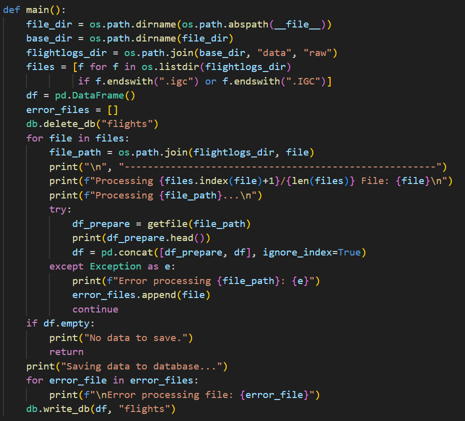**

1.  “IGC\_file\_parse.py” Python Modülü (Kısmi Görünümü)

IGC dosyasından verilerin alınabilmesi için “IGC\_file\_parse.py” (bkz. Şekil 1) adında bir Python modülü yazılmıştır. Bu modül;

-   Bir klasör içindeki “.igc” uzantılı tüm IGC uçuş kayıtlarının satırlarını parçalayıp dosya ismi, zaman, pilot ismi, enlem, boylam, GPS yükseklik ve Barometrik yükseklik verilerini çıkarır,
-   Pandas DataFrame’e dönüştürüp uçuş tarihi ve pilot bilgisini ekler,
-   İsteğe bağlı olarak veri örneklemesi (log interval) yapar (varsayılan olarak veri örneklemesi 1 sn.dir),
-   Son olarak bu derlenmiş verileri “flights” adlı veritabanı tablosuna yazar.

Yani temel olarak IGC dosyalarındaki ham uçuş verisini okunabilir bir formata getirip veritabanına aktaran bir ön işleme betiğidir.

### Uçuş Kayıtları İçin Hava Durumu Verilerinin Alınması

**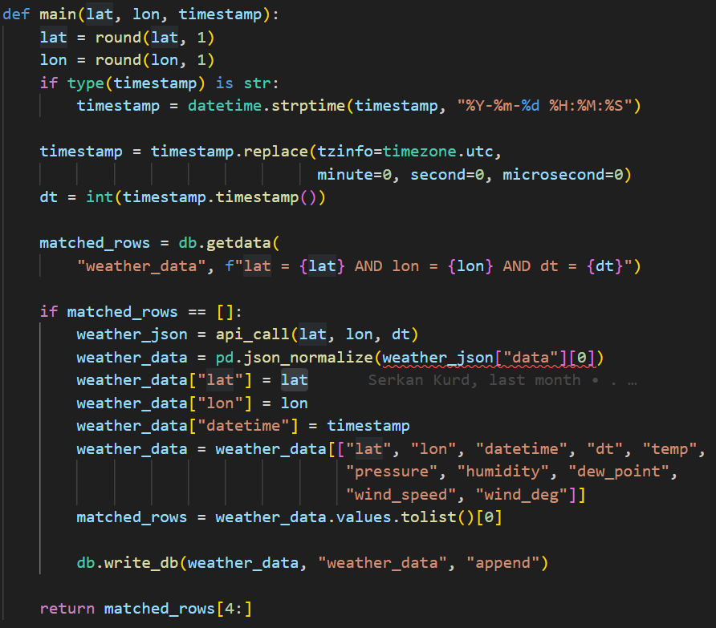**

1.  “weather\_data.py” Python Modülü (Kısmi Görünümü)

Hava durumu verilerinin alınması için “weather\_data.py” (bkz. Şekil 2) adında bir Python dosyası yazılmıştır. Bu dosya; belirli bir enlem-boylam ve zaman için geçmiş hava durumu verilerini OpenWeatherMap’in One Call Timemachine API’sinden \[13\] çekmek, normalize etmek, bir veritabanında önbelleklemek ve son olarak temel hava durumu parametrelerini (sıcaklık, basınç, nem, çiy noktası, rüzgar hızı ve rüzgar yönü) döndürmek için tasarlanmış bir Python modülüdür.

Bu modül enlem ve boylamları virgülden sonra bir basamak olacak şekilde (örneğin Enlem 40.0 Boylam 32.3) alarak saatlik olarak sorgular. Uçuş kaydı 40.1 Enlemine geçtiğinde veya zaman verisi bir sonraki saate geçtiğinde hava durumu verisi tekrar yeni koordinata ve saat verisine göre sorgulanır. Böylece uçuş (10km X 10km) 100 km[^2]’lik alanlara bölünerek her bir alan için saatlik hava durumu verisi alınmış olur.

**3.1.4.Uçuş Kayıtlarının Toplanması**

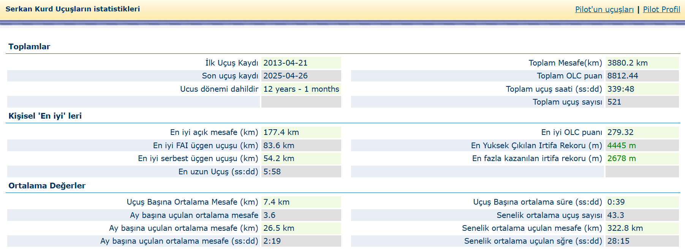

1.  Leonardo Pilot Uçuş İstatistiği

YPForum’un “Leonardo” sayfası \[14\]; Türkiye Yamaç Paraşütü Forumu çatısı altında pilotların Leonardo yazılımı aracılığıyla yüklediği IGC uçuş kayıtlarını toplayıp listeleyen bir arayüz sunar (bkz. Şekil 3). Sayfa, kulüp/lig, sezon ve ay seçiminin yanı sıra kalkış bölgesi, ekipman markası ve kategorisi (yamaçparaşütü, yelkenkanat, planör, paramotor, powered flight), sınıf (sport, açık, tandem, fun cup), XC tipi (3 turnpoint, open/closed triangle) gibi çok katmanlı bir filtreleme sistemi içerir. Listelenen her uçuş kaydı; tarih, pilot adı, kalkış noktası, uçuş süresi, açık mesafe, OLC mesafesi ve OLC puanı gibi temel bilgilerin yanı sıra “Google Earth ile Tüm Uçuşlar” ve “Google Map’de görüntüleme” bağlantılarıyla coğrafi görselleştirme imkânı verir; ayrıca kayıtlı Pilotlar yeni IGC dosyalarını sisteme yükleyebilir ve kendi uçuş istatistiklerini görebilir.

OLC km.si; yüklenen uçuş izi içerisinden en uzun rota veya en uygun altı bacaklı uçuş bölümünü hesaplayarak ham mesafeyi kilometre cinsinden belirler. Bu değer uçuşun cinsine göre serbest uçuşta 1,5 ile, serbest üçgen uçuşunda 1,75 ile, FAI üçgen uçuşunda 2 ile çarpılarak OLC puanı elde edilir \[3\]. Veri setine en yüksek OLC puanına sahip 100 Yamaç Paraşütü uçuş kaydı seçildi ve işlenmek üzere IGC dosyaları alındı.

## Verilerin Hazırlanması

İndirilen uçuş kayıtları sırayla “prepare\_flightlog.py” Python modülü ile önce “IGC\_file\_parse.py” ile okundu ve “weather\_data.py” ile hava durumu verileri alınarak elde edilen veriler veritabanına yazıldı.

Ayrıca bu aşamada veri setine yeni değişkenler eklendi. Bu değişkenlerin bazıları model eğitiminde kullanılmayacak olup yeni hesaplamalara yardımcı olması veya ileride farklı modellerin eğitimi için eklenirken, “distance\_m”, “speed\_km/s”, “climb\_rate\_m/s”, “glide\_ratio”, “bearing”, “delta\_bearing”, “elapsed\_time” değişkenleri modelin eğitiminde kullanılmak üzere veri setine eklendi (bkz. Tablo 3).

1.  İlk Veri Seti

| **filename** | IGC dosyasının ismi |
| --- | --- |
| **datetime** | Tarih ve saat bilgisi |
| --- | --- |
| **pilot** | Pilotun ismi |
| --- | --- |
| **latitude** | Boylam bilgisi |
| --- | --- |
| **longitude** | Enlem bilgisi |
| --- | --- |
| **gps\_altitude\_m** | GPS irtifa bilgisi |
| --- | --- |
| **pressure\_altitude\_m** | Barometrik irtifa bilgisi |
| --- | --- |
| **previous\_latitude** | (Yeni değişken) Bir önceki noktanın boylam bilgisi (mesafe bilgisini hesaplamak için eklendi) |
| --- | --- |
| **previous\_longitude** | (Yeni değişken) Bir önceki noktanın enlem bilgisi (mesafe bilgisini hesaplamak için eklendi) |
| --- | --- |
| **distance\_from\_takeoff\_m** | (Yeni değişken) Kalkış alanından olan uzaklık (ilk nokta ile olan uzaklıktan hesaplandı) |
| --- | --- |
| **distance\_m** | (Yeni değişken) Bir önceki noktaya olan uzaklık |
| --- | --- |
| **speed\_km/s** | (Yeni değişken) Hız |
| --- | --- |
| **climb\_m** | (Yeni değişken) Tırmanılan yükseklik (alçalışta negatif değer alır) |
| --- | --- |
| **climb\_m(delta)** | (Yeni değişken) Son 20 sn.deki tırmanış verisi |
| --- | --- |
| **climb\_rate\_m/s** | (Yeni değişken) Tırmanış hızı |
| --- | --- |
| **glide\_ratio** | (Yeni değişken) Süzülüş |
| --- | --- |
| **bearing** | (Yeni değişken) Uçuşun grid istikamet açısı |
| --- | --- |
| **delta\_bearing** | (Yeni değişken) Dönüş açısı. Pozitif ise sola, negatif ise sağa dönüş |
| --- | --- |
| **elapsed\_time** | (Yeni değişken) Uçuş başlangıcından itibaren geçen zaman |
| --- | --- |
| **delta\_time** | (Yeni değişken) Bir önceki nokta ile geçen zaman |
| --- | --- |
| **temp** | Sıcaklık |
| --- | --- |
| **pressure** | Basınç |
| --- | --- |
| **humidity** | Nem |
| --- | --- |
| **dew\_point** | Çiğ noktası |
| --- | --- |
| **wind\_speed** | Rüzgar hızı |
| --- | --- |
| **wind\_deg** | Rüzgarın yönü (grid istikamet açısı) |
| --- | --- |

## Verilerin Temizlenmesi

Bu aşamada “process\_flightdata.ipynb” Python modülü ile verilerin temizlenmesi işlemi yapıldı. Verilere bakıldığında, bazı verilerde aykırı gözlemler bulunduğu Tablo 4’te görülmektedir. Örneğin maksimum “speed\_km/s” 30846 km/s veya minimum “climb\_m” -4589 m. olarak görülmektedir.

1.  Aykırı (Outlier) Gözlem Görülen Veriler

|  | **mean** | **min** | **25%** | **50%** | **75%** | **max** | **std** |
| --- | --- | --- | --- | --- | --- | --- | --- |
| **gps\_altitude\_m** | 2163,917037 | \-7347 | 974 | 2255 | 2861 | 16170 | 2045,947216 |
| --- | --- | --- | --- | --- | --- | --- | --- |
| **distance\_m** | 16,23616031 | 0 | 11,19587308 | 14,73456175 | 17,22443897 | 248482,8974 | 166,7365368 |
| --- | --- | --- | --- | --- | --- | --- | --- |
| **speed\_km/s** | 49,8724426 | 0 | 39,7070692 | 51,13472026 | 60,8658637 | 30846,15278 | 30,97632772 |
| --- | --- | --- | --- | --- | --- | --- | --- |
| **climb\_m** | \-0,017745955 | \-4589 | \-2 | 0 | 2 | 6638 | 35,04061232 |
| --- | --- | --- | --- | --- | --- | --- | --- |
| **climb\_m(delta)** | \-0,396573361 | \-4588 | \-29 | 0 | 28 | 6614 | 67,63082216 |
| --- | --- | --- | --- | --- | --- | --- | --- |
| **climb\_rate\_m/s** | 0,004177606 | \-4589 | \-1,5 | 0 | 1 | 4210 | 25,0764156 |
| --- | --- | --- | --- | --- | --- | --- | --- |
| **glide\_ratio** | 7,7436804 | 0 | 3,093184548 | 6,476716524 | 11,48777607 | 1444,240719 | 7,265673941 |
| --- | --- | --- | --- | --- | --- | --- | --- |

Aykırı gözlemlerin temizliğine başlamadan önce veri setinden “pilot”, “pressure\_altitude\_m”, “previous\_latitude”, “previous\_latitude”, “distance\_from\_takeoff\_m” değişkenleri çıkarılmıştır. “pressure\_altitude\_m” değişkeninin bazı pilotların uçuş kayıtlarında cihazlar tarafından hiç kaydedilmediği fark edildiği için çıkarılmıştır.

Tablo 4’de görülen; aykırı gözlem verileri içeren değerlerin temizlenmesinde, standart sapma ve ortalama esas alınarak hesaplanan z-skor (z-score) yöntemi tercih edilmiştir. Z-skor, her bir gözlemin dağılımdaki yerine göre ne kadar "uçta" olduğunu gösterir ve özellikle büyük veri setlerinde hızlıca aykırı noktaları tespit etmeyi sağlar (atıf eklenmesinde yarar var). Bu çalışmada, z-skoru > 3 olan (yani ortalamadan üç standart sapmadan fazla uzak olan) gözlemler aykırı olarak kabul edilip veri setinden çıkarılmıştır. Bu seçim, aşırı uç noktaların model eğitiminde gereksiz sapmalara neden olmasını engeller. Uygulama sonucunda, veri dağılımında gözle görülür bir iyileşme elde edilmiş ve modellerin hem doğruluk hem de genelleme yeteneği olumlu yönde etkilenmiştir. Z-skor yöntemi, özellikle uçuş verilerinin doğasından kaynaklanan ekstrem değerlerin otomatik ve nesnel biçimde ayıklanmasını sağlayarak, temiz ve güvenilir bir eğitim seti oluşturulmasına olanak vermiştir.

𝑥: İncelenen gözlem değeri  
μ: Tüm veri setinin ortalaması  
σ: Tüm veri setinin standart sapması

1.  Verinin Son Hali

|  | **count** | **mean** | **min** | **25%** | **50%** | **75%** | **max** | **std** |
| --- | --- | --- | --- | --- | --- | --- | --- | --- |
| **latitude** | 1516903 | 38,45002778 | 36,50395 | 37,41405 | 38,38046667 | 39,23861667 | 42,72443333 | 1,107923595 |
| --- | --- | --- | --- | --- | --- | --- | --- | --- |
| **longitude** | 1516903 | 32,20130848 | 24,63248333 | 30,20254167 | 32,34353333 | 32,76135 | 41,04868333 | 2,782908161 |
| --- | --- | --- | --- | --- | --- | --- | --- | --- |
| **datetime** | 1516903 | 2019-11-18 20:16:21 | 2011-07-12 09:42:41 | 2018-07-15 12:41:57 | 2020-07-13 10:45:11 | 2020-08-07 14:11:44 | 2024-08-19 16:29:49 |  |
| --- | --- | --- | --- | --- | --- | --- | --- | --- |
| **gps\_altitude\_m** | 1516903 | 2521,917386 | 16 | 2062 | 2523 | 2972 | 8500 | 663,67433 |
| --- | --- | --- | --- | --- | --- | --- | --- | --- |
| **distance\_m** | 1516903 | 13,86962223 | 1,422485689 | 10,98388102 | 14,21199779 | 17,09670639 | 27,63880399 | 4,409383095 |
| --- | --- | --- | --- | --- | --- | --- | --- | --- |
| **speed\_km/s** | 1516903 | 49,93064003 | 5,120948479 | 39,54197169 | 51,16319205 | 61,54814302 | 99,49969437 | 15,87377914 |
| --- | --- | --- | --- | --- | --- | --- | --- | --- |
| **climb\_m** | 1516903 | 0,019855587 | \-6 | \-1 | 0 | 1 | 6 | 2,091508346 |
| --- | --- | --- | --- | --- | --- | --- | --- | --- |
| **climb\_m(delta)** | 1516903 | 0,541685922 | \-165 | \-27 | 1 | 27 | 165 | 35,68123758 |
| --- | --- | --- | --- | --- | --- | --- | --- | --- |
| **climb\_rate\_m/s** | 1516903 | 0,019855587 | \-6 | \-1 | 0 | 1 | 6 | 2,091508346 |
| --- | --- | --- | --- | --- | --- | --- | --- | --- |
| **glide\_ratio** | 1516903 | 7,413504859 | 0 | 2,992604002 | 6,366650722 | 11,31659249 | 27,61552611 | 5,84233604 |
| --- | --- | --- | --- | --- | --- | --- | --- | --- |
| **bearing** | 1516903 | 145,2900508 | 0 | 69 | 148 | 201 | 356 | 90,45107935 |
| --- | --- | --- | --- | --- | --- | --- | --- | --- |
| **delta\_bearing** | 1516903 | 9,854460041 | 0 | 2 | 6 | 13 | 180 | 12,89736521 |
| --- | --- | --- | --- | --- | --- | --- | --- | --- |
| **elapsed\_time** | 1516903 | 13619,79461 | 1 | 6726 | 13438 | 20122 | 36461 | 8053,16822 |
| --- | --- | --- | --- | --- | --- | --- | --- | --- |
| **delta\_time** | 1516903 | 1 | 1 | 1 | 1 | 1 | 1 | 0 |
| --- | --- | --- | --- | --- | --- | --- | --- | --- |
| **temp** | 1516903 | 30,94195163 | 19,6 | 28,64 | 30,62 | 33,13 | 41,11 | 3,504457478 |
| --- | --- | --- | --- | --- | --- | --- | --- | --- |
| **pressure** | 1516903 | 1007,346132 | 1001 | 1006 | 1007 | 1009 | 1015 | 2,388516999 |
| --- | --- | --- | --- | --- | --- | --- | --- | --- |
| **humidity** | 1516903 | 26,90490427 | 9 | 22 | 27 | 32 | 58 | 7,400792996 |
| --- | --- | --- | --- | --- | --- | --- | --- | --- |
| **dew\_point** | 1516903 | 9,109069697 | \-2,23 | 6,99 | 9,29 | 11,23 | 22,25 | 3,050062263 |
| --- | --- | --- | --- | --- | --- | --- | --- | --- |
| **wind\_speed** | 1516903 | 3,256551348 | 0 | 2,27 | 3,25 | 4,18 | 8,7 | 1,382203176 |
| --- | --- | --- | --- | --- | --- | --- | --- | --- |
| **wind\_deg** | 1516903 | 229,3493842 | 0 | 188 | 262 | 329 | 360 | 114,5344914 |
| --- | --- | --- | --- | --- | --- | --- | --- | --- |

Temizlenmiş veriler (bkz. Tablo 5), veri tabanında ‘flights\_cleaned’ adlı tabloya kaydedildi.

Araştırma soruları ve hipotezler çerçevesinde çalışmadaki bağımsız değişkenler: GPS koordinatları (enlem, boylam), irtifa (yükseklik), hız (yer hızı, dikey hız vb.), uçuş süresi, uçuş mesafesi, maksimum irtifa, ortalama tırmanış oranı, maksimum tırmanış oranıdır. Bağımlı değişkenler: Pilotun uçuş performansı, pilotun uçuş yeteneği/gelişimi ve uçuş güvenliğidir (risk düzeyi). Ayrıca kontrol edilebilen veya düzenleyici değişkenler ise kullanılan ekipman türü (kanat modeli, harness), pilotun deneyim seviyesi (uçuş saatleri), meteorolojik koşullar (rüzgar hızı, hava sıcaklığı vb.) ve termik aktivitesi seviyesi (termik; ısınan havanın yükselmesi) olarak sıralanabilir. Bu şekilde yamaç paraşütleri kilometrelerce yol kat edebilirler.

# Bulgular

Bu bölümde, araştırma kapsamında toplanan veriler üzerinde gerçekleştirilen makine öğrenmesi ve derin öğrenme modellemeleri ile elde edilen sonuçlar ayrıntılı olarak sunulmaktadır. Modellerin performans değerlendirmeleri ve analiz edilen uçuş verilerine ilişkin temel bulgular aşağıda paylaşılmıştır.

## Makine Öğrenmesi Modellerinin Orange Uygulaması ile Ön Değerlendirmesi

Bu projenin başlangıç seviyesinde Makine Öğrenmesi modellerinin performansını değerlendirmek ve hızlı bir şekilde modellerde düzenleme yapmak için önce “Orange” uygulaması üzerinden veri setinin ilk 100.000 kaydı ile denemeler yapılmıştır.

Orange \[15\], açık kaynaklı ve kullanıcı dostu bir veri madenciliği ile makine öğrenmesi platformudur; sürükle-bırak tabanlı görsel iş akışları sayesinde CSV, Excel veya SQL gibi farklı kaynaklardan veri setlerini hızlıca içe aktarır, temizler ve normalize eder, ardından sınıflandırma, regresyon, kümeleme ve boyutsal indirgeme gibi adımları temsil eden widget’lar aracılığıyla kod yazmadan analiz hatları oluşturmanızı sağlar; Scikit-learn altyapılı hazır modelleri (Karar Ağaçları, Random Forest, SVM, k-NN vb.) görsel olarak yapılandırıp performanslarını değerlendirirken, etkileşimli grafikler (korelasyon matrisleri, ROC eğrileri, kümeleme diyagramları vb.) üzerinden verinizdeki örüntüleri keşfetmenize olanak tanır.

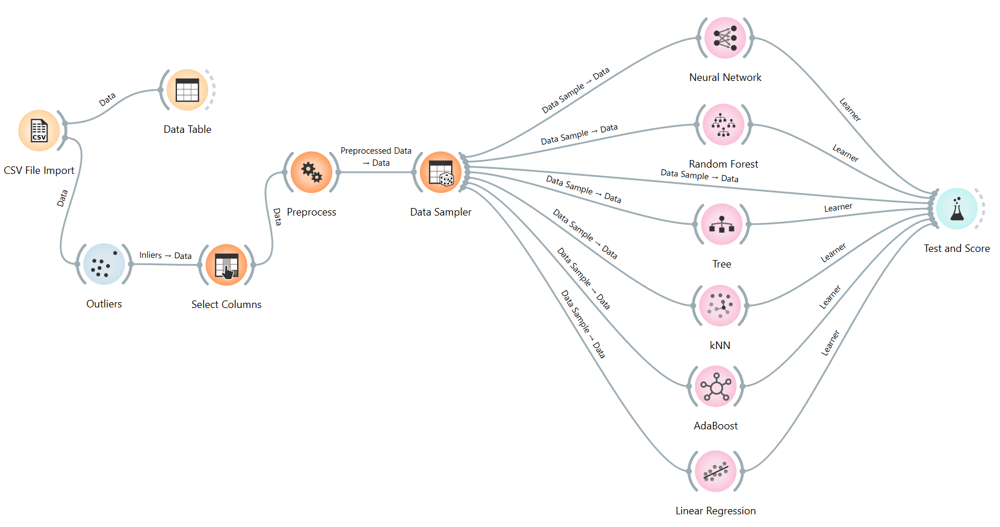

1.  Orange Uygulaması Akış Şeması

“3.3.Verilerin Temizlenmesi” bölümünde elde edilen ve “flights\_cleaned” tablosuna kaydedilen verileri “flights\_cleaned.csv” dosyasına çıktı alarak Orange uygulamasının “CSV File Import” ile giriş yapılmıştır. Verileri “Data Table” üzerinden gördükten sonra verinin “Outliers” altına girişi yapılmıştır. Diğer bölümde aykırı (outlier) gözlemler “zskor” ile ayıkladından aslında bu widget’a ihtiyaç kalmamıştır. Ancak çalışmanın ilk dönemlerinde bunu eklemenin makine öğrenmesi başarımında önemli etkisi olmuştu. Bu nedenle akıştan çıkarılmadı. “Select Columns” ile makine öğrenmesi için kullanılacak değişkenler seçilir.

Bu çalışmanın en önemli kısmı olması nedeniyle, seçilen değişkenlerle ilgili vurgulanması gereken bazı hususlar vardır. Seçilen değişkenler; “gps\_altitude\_m”, “distance\_m”, “speed\_km/s”, “glide\_ratio”, “bearing”, “delta\_bearing”, “temp”, “pressure”, “humidity”, “dew\_point”, “wind\_speed”, “wind\_deg”. Tahmin edilecek olan özellik ise “climb\_rate\_m/s”. Dikkat edilecek olursa “climb\_m” değişkenin dahil edilmediği görülmektedir. Bunun ayrıntıları şu şekilde açıklanabilir:

Her iki değişken arasında fiziksel bağımlılık (zamana bağlı entegrasyon) vardır. Tırmanış hızı (climb\_rate\_m/s), birim zamanda (saniye) kazanılan dikey mesafe değerini (m/s cinsinden) ifade eder. Tırmanış (climb\_m) ise uçuş süresi boyunca toplam kazanılan dikey mesafeyi (metre cinsinden) gösterir. Bu ikisi arasında şöyle bir temel denklem \[19\] vardır:

Sürekli kayıt altındaysak, her an için tırmanış hızı integralini alarak o ana kadar kazanılan irtifa (“climb\_m”) bulunur. Örnek (ayrık örnekleme için): her Δt saniyelik aralıkta ölçülen tırmanış hızları 𝑟~𝑖~ ise,

Ayrıca bu iki değişken arasında istatistiksel bağımlılık (Korelasyon/Kovaryans) da vardır. Veri setindeki iki sütun arasındaki doğrusal ilişkiyi nicelleştirmek için Pearson \[20\] korelasyon katsayısını hesaplayabilirz ρ≈1 ise güçlü doğru orantı, ρ≈0 ise ilişkisizlik, ρ≈–1 ise ters orantı anlamına gelir.

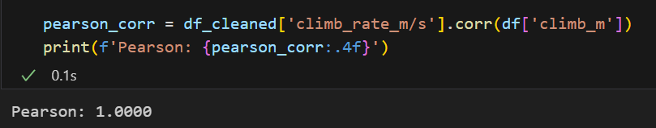

1.  Pearson Korelasyonu

Şekil 5’de görüldüğü üzere bu iki değişken birbirine tam bağımlı bir değişkendir. Bu nedenle modellerin eğitimine tırmanış değişkeni eklenmemiştir.

“Preprocces” bölümünde (bkz. Şekil 4) ise verilere Standardize işlemine tabi tutuldu. Böylece tüm verilerin ortalaması 0’a ve varyansı 1’e getirildi. “Data Sampler” bölümünde (bkz. Şekil 4) veri %70 eğitim kümesi ve %30 test kümesi olarak ikiye bölündü.

Şekil 6’daki regresyon modellerinin “climb\_rate\_m/s” değerini tahmin ederken elde ettiği hata metriklerini (MSE, RMSE, MAE) ve R² skorunun (determinasyon katsayısı) “Test and Score” widget çıktısıdır.

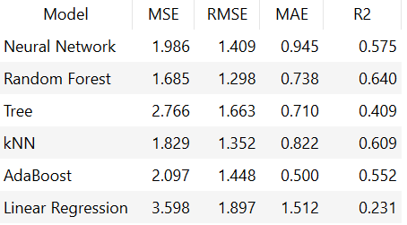

1.  Orange Uygulaması “Test and Score” Widget Çıktısı

MSE (Mean Squared Error – Ortalama Kare Hata): Gerçek değer ile tahmin arasındaki farkların karelerinin ortalamasıdır. Hataları “kare” olarak cezalandırdığından, büyük sapmalara daha yüksek ağırlık verir.

RMSE (Root Mean Squared Error – Kök Ortalama Kare Hata): MSE’nin karekökü. Birimi, orijinal hedef değişkenin birimi ile aynıdır, dolayısıyla yorumlamak daha kolaydır.

MAE (Mean Absolute Error – Ortalama Mutlak Hata): Hataların mutlak değerlerinin ortalamasıdır. Çok büyük sapmaları MSE kadar güçlü cezalandırmaz; “ortalama sapma” olarak okunabilir.

R² (Coefficient of Determination – Açıklanan Varyans Oranı) Modelin, ortalamaya karşı ne kadar varyansı “açıklayabildiğini” gösterir.

MSE/RMSE/MAE: Tahminin gerçek değerden ne kadar “uzak” olduğunu sayısal olarak gösterir. R², modelin verideki varyansın ne kadarını açıkladığını, 1’e yaklaştıkça “iyi uyum” demektir, 0’ın altına inmesi aşırı kötü uyuma işaret eder.

1.  Modellerin Karşılaştırılması

| **Model** | **MSE** | **RMSE** | **MAE** | **R²** | **Yorum** |
| --- | --- | --- | --- | --- | --- |
| **Random Forest** | 1.685 | 1.298 | 0.738 | 0.640 | • En düşük MSE & RMSE en küçük ortalama kare hataya sahip   • Yüksek R² (0.64) verinin %64’ünü açıkladı • MAE de oldukça iyi |
| --- | --- | --- | --- | --- | --- |
| **k-NN** | 1.829 | 1.352 | 0.822 | 0.609 | • İkinci en iyi MSE/RMSE   • R² = 0.61 tatminkâr açıklama • Basit, parametrik olmayan yöntem; veri miktarı arttıkça daha da güçlü |
| --- | --- | --- | --- | --- | --- |
| **Neural Network** | 1.986 | 1.409 | 0.945 | 0.575 | • Orta seviyede performans   • R² ≈ 0.58 verinin %58’ini açıklıyor |
| --- | --- | --- | --- | --- | --- |
| **AdaBoost** | 2.097 | 1.448 | **0.500** | 0.552 | • En düşük MAE (ortalama sapma) çoğu tahmini ortalamaya yaklaştırdı   • Ancak MSE/RMSE yüksek • R² ≈0.55 verinin %55’ini açıklıyor |
| --- | --- | --- | --- | --- | --- |
| **Decision Tree** | 2.766 | 1.663 | 0.710 | 0.409 | • Aşırı uyum (overfit) eğilimli tek ağaç test hatası yüksek   • R² düşük (0.41) varyansın yarısını bile açıklayamıyor |
| --- | --- | --- | --- | --- | --- |
| **Linear Reg.** | 3.598 | 1.897 | 1.512 | 0.231 | • En kötü MSE, RMSE ve MAE   • Çok düşük R² verinin sadece %23’ünü açıklayabiliyor |
| --- | --- | --- | --- | --- | --- |

Tablo 6, aynı veri setine uygulanan altı farklı regresyon modelinin performans karşılaştırmasıdır. Random Forest genel olarak en dengeli ve başarılı sonuçları vermektedir. AdaBoost ise ortalama mutlak hatayı en iyi, k-NN ise parametrik ayar gerektirmeyen güçlü bir alternatif olarak öne çıkmaktadır. Neural Network biraz geride kalsa da büyük veri ve hiperparametre optimizasyonu veya zaman serisi ile iyileştirilebilir. Decision Tree ve Linear Regression ise karmaşık ilişkileri modellemekte zorlandıkları için daha düşük performans sergilemişlerdir.

## Makine Öğrenmesi Modellerinin Sklearn ve Tensorflow Python Kütüphaneleri ile Değerlendirilmesi

Bu bölümde Orange uygulaması üzerinden elde edilen veriler kullanılarak Sklearn ve Tensorflow Python Kütüphaneleri ile yeni modeller oluşturulmuş ve performansları değerlendirilmiştir.

scikit-learn kütüphanesi \[16\], Python ekosisteminde geleneksel makine öğrenmesi algoritmalarını (SVM, random forest, k-means, vb.) hızlıca prototiplemek ve değerlendirmek için tasarlanmıştır. NumPy ve SciPy üzerine inşa edilen bu kütüphane; eğitim-test bölme, çapraz doğrulama, ızgara arama gibi model seçimi araçlarıyla birlikte; ölçekleme, özellik çıkarma ve dönüştürme gibi ön işleme adımlarını tutarlı bir API üzerinden sunar. CPU üzerinde çalışması ve GPU gerektirmemesi, küçük ve orta ölçekli veri setleri için hafif ve verimli bir çözüm sağlar.

TensorFlow \[17\] ise derin öğrenme odaklı, Google destekli açık kaynak bir platformdur ve Keras API’si sayesinde hem yüksek seviyede hızlı model geliştirme hem de düşük seviyede grafik tabanlı hesaplamalar üzerinde ince ayar yapma imkânı tanır. Otomatik türev alma özelliği sayesinde geri yayılım (backpropagation) çok daha basit hale gelirken; GPU ve dağıtık eğitim desteği, büyük veri setleri ve karmaşık sinir ağlarıyla çalışmayı mümkün kılar. TensorBoard ile eğitim süreçlerini görselleştirme, TensorFlow Lite/JS ile mobil ve web üzerinde dağıtım gibi zengin bir ekosisteme sahiptir.

| 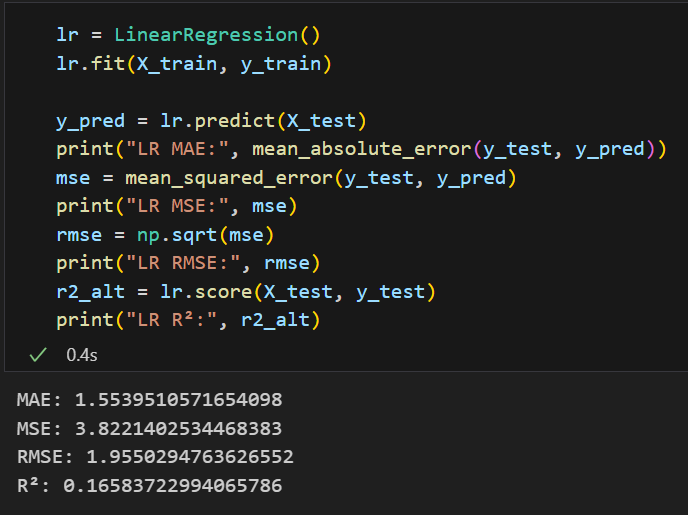 | 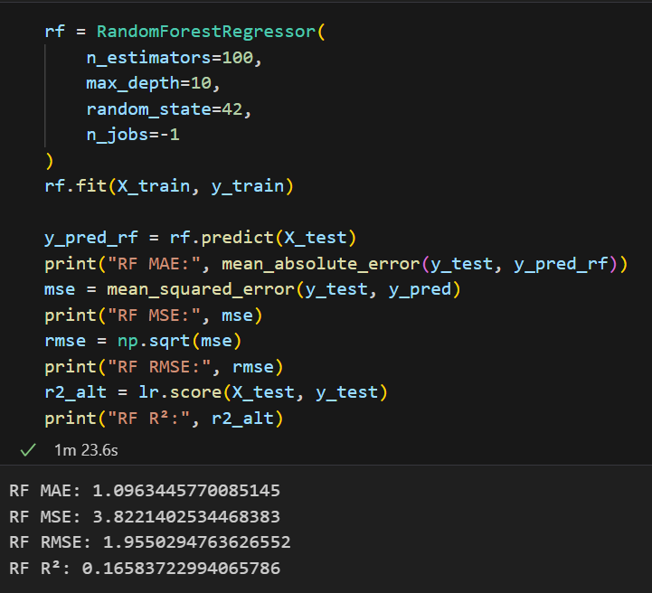 | 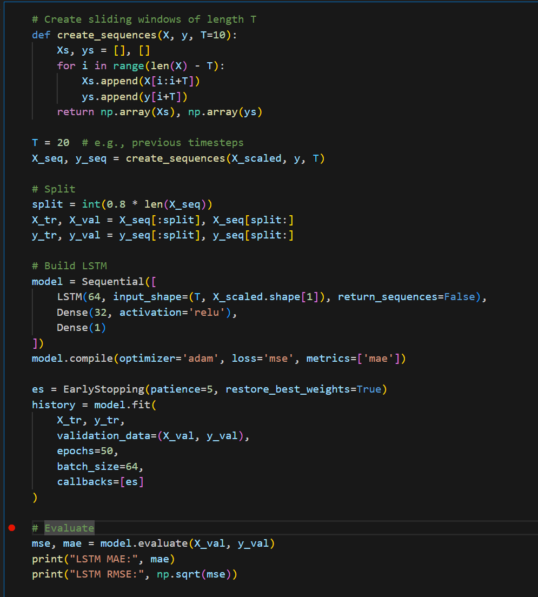  
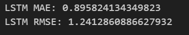 |
| --- | --- | --- |
| Linear Regression: MAE, MSE, RMSE ve R[^2] Performansı | Random Forest: MAE, MSE, RMSE ve R[^2] Performansı | LSTM: MAE ve RMSE Performansı |
| --- | --- | --- |
| 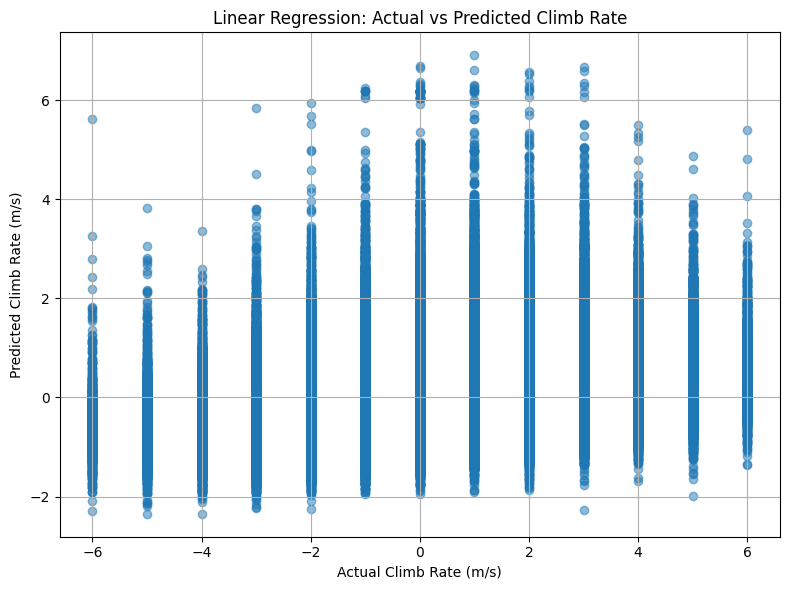   Linear Regression: Tahmin Edilen ve Gerçek Tırmanma Verisinin Karşılaştırması |  Random Forest: Tahmin Edilen ve Gerçek Tırmanma Verisinin Karşılaştırması | 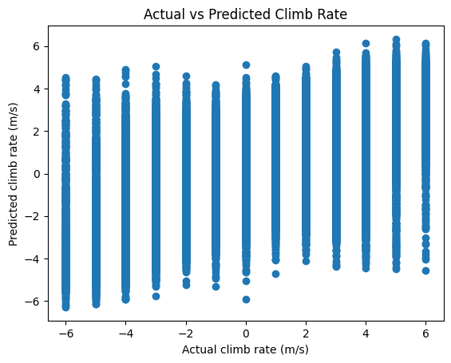 LSTM: Tahmin Edilen ve Gerçek Tırmanma Verisinin Karşılaştırması |
| --- | --- | --- |

1.  Makine Öğrenmesi Modellerinin Karşılaştırılması

| 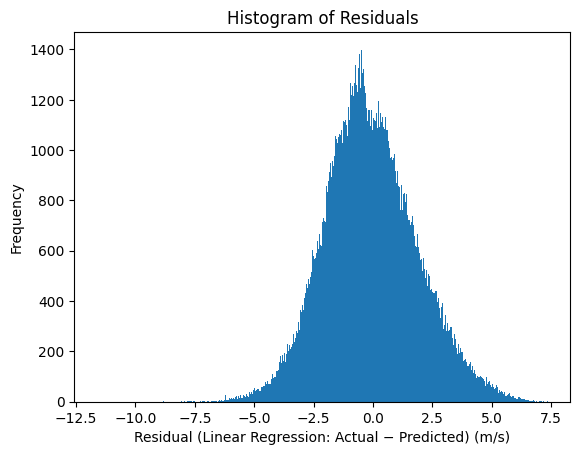  
Linear Regression: Tahmin Hatasının Dağılımı (Gerçek Tırmanma – Tahmin Edilen Tırmanma) | 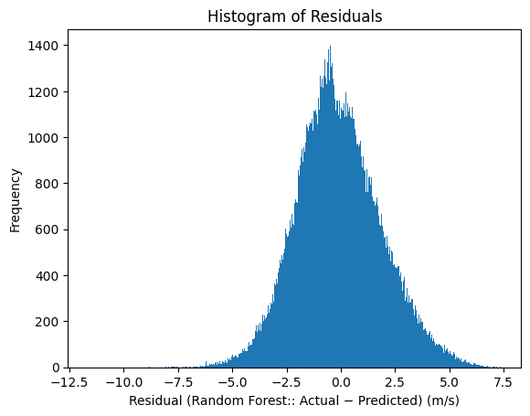  
Random Forest: Tahmin Hatasının Dağılımı (Gerçek Tırmanma – Tahmin Edilen Tırmanma) | 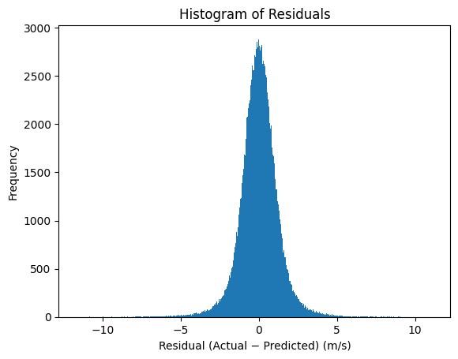LSTM: Tahmin Hatasının Dağılımı (Gerçek Tırmanma – Tahmin Edilen Tırmanma) |
| --- | --- | --- |

1.  Makine Öğrenmesi Modellerinin Tahmin Hata Dağılımları

| 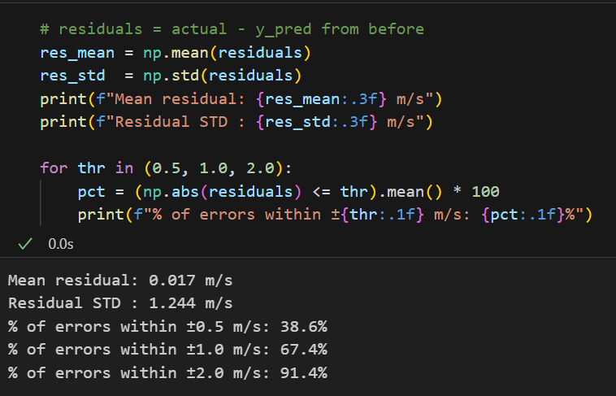  
LSTM: Tahmin Hatası Ortalaması ve Standart Sapması (Gerçek Tırmanma – Tahmin Edilen Tırmanma) | 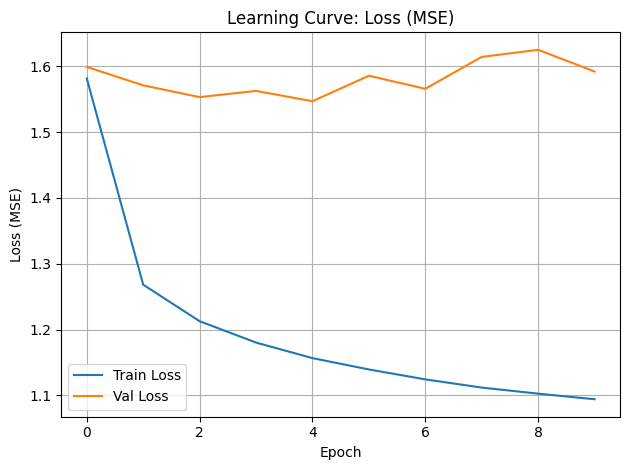  
LSTM: Öğrenme Eğrisi (MSE) | 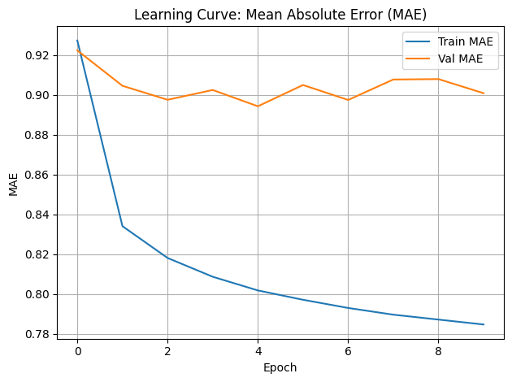  
LSTM: Öğrenme Eğrisi (MAE) |
| --- | --- | --- |

1.  LSTM Modeli

***Linear Regression Modeli***

Linear Regression (Doğrusal regresyon) modeli test verisinde ortalama 1,55 m/s MAE ve 1,96 m/s RMSE değeri, ayrıca yalnızca ~0,17’lik bir R² skoru elde etti; bu da modelin tırmanış verisinin çok azını lineer ilişkiyle açıklayabildiğini gösteriyor. Gerçek vs. tahmin grafiğinde noktalar “y = x” doğrusundan ciddi sapmalar ve belirli değer kümeleşmeleri sergilediği gibi, artıkların histogramı da hafifçe sola çarpık bir dağılım göstererek modelin genelde tahminleri fazla yüksek tuttuğunu işaret ediyor. Bu sonuçlar, non-lineer etkileşimleri ve uç değerleri daha iyi yakalayacak daha esnek modeller (örneğin polinom, ağaç tabanlı veya derin öğrenme yöntemleri) ile detaylı özellik mühendisliğine ihtiyaç olduğunu ortaya koyuyor (bkz. Şekil 7 ve 8).

***Random Forest Modeli***

Random Forest modeli, test verisindeki tırmanış MAE ≈ 1.10 m/s ve RMSE ≈ 1.96 m/s düzeyinde tahmin ediyor; MSE ≈ 3.82 (m/s)² ve R² ≈ 0.17 ile verinin yalnızca %17’sini açıklayabiliyor. Tahminler, aşırı düşük ve yüksek tırmanışları ortalama değerlere yakınlaştırma eğiliminde; dağılımda dik dikey çizgiler göze çarpıyor. Hataların histogramı neredeyse Gauss’a benzer bir çan eğrisi sergiliyor, ancak ±7 m/s’ye kadar uzanan ağır kuyruklar; dağılımın ortalaması sıfıra yakın, hafif negatif önyargı söz konusu. Genel olarak model uçuş verisindeki değişkenliği yakalamakta zorlanıyor ve uç sınırlarda belirgin sapmalar yapıyor (bkz. Şekil 7 ve 8).

***LSTM Modeli***

Model zaman seri bir LSTM modeli olarak kurulmuş olup 20sn.lik zaman dilimleri kullanmaktadır. Model, doğrulama setinde MAE olarak yaklaşık 0,90 m/s ve RMSE olarak yaklaşık 1,24 m/s elde etti (bkz. Şekil 9). Tahmin hatası (residüller) ortalama ~0,02 m/s etrafında toplanmış, standart sapma ~1,24 m/s; tahminlerin %38,6’sı ±0,5 m/s, %67,4’ü ±1,0 m/s ve %91,4’ü ±2,0 m/s tolerans içinde kaldı. Öğrenme eğrileri eğitim kaybının MSE ve MAE’nin düzenli olarak azalırken doğrulama kaybı ve MAE’sinin 1,5 MSE/0,90 MAE civarında sabitlenmesi, modelin eğitim verisinde öğrendiklerini genellemede sınırlı ölçüde yansıttığını gösteriyor (bkz. Şekil 9).

## Makine Öğrenmesi LSTM, RNN, CNN ve Transformer Derin Öğrenme Modellerinin Değerlendirilmesi

LSTM modelinin diğer modellerden daha başarılı olmasından dolayı RNN, CNN ve Transformer Derin Öğrenme Modelleri birlikte eğitilerek karşılaştırma yapılmasına karar verilmiştir. Bu modelleri kısaca şöyle özetlenebilir:

***Recurrent Neural Network (RNN)***

RNN’ler \[18\], sıralı (sequence) verilerdeki zamansal bağımlılıkları yakalamak üzere geliştirilmiş sinir ağlarıdır. Ağın her adımında hem o andaki girdi hem de bir önceki adımın gizli (hidden) durumu işlenerek yeni bir çıktı ve güncellenmiş bir gizli durum üretilir. Böylece örneğin bir cümledeki sözcükleri tek tek işlerken önceki sözcük bilgisi sonraki tahminlere aktarılabilir. Ancak uzun dizilerde “gradyan kaybolması” (vanishing gradient) veya “gradyan patlaması” (exploding gradient) sorunları yaşayabileceğinden, çok uzun bağımlılıkları modellik etmekte zorlanabilir.

***Long Short-Term Memory (LSTM)***

LSTM’ler \[18\], klasik RNN’lerin uzun bağlamlardaki eğitim zorluklarını aşmak için özel olarak tasarlanmış bir çeşit tekrarlı katmandır. İçlerinde “giriş”, “unutma” ve “çıkış” kapıları barındıran katmanlar sayesinde hangi bilginin ağ hafızasında (cell state) tutulacağı, hangisinin silineceği ya da güncelleneceği dinamik olarak denetlenir. Bu sayede yüzlerce adıma yayılan bağımlılıkları bile öğrenebilir; konuşma, makine çevirisi, müzik oluşturma gibi uzun diziler gerektiren görevlerde RNN’lere kıyasla çok daha başarılıdır.

***Convolutional Neural Network (CNN)***

CNN’ler \[18\], özellikle görüntü verisi gibi 2B (veya 3B) uzaydaki yerel örüntüleri tanımada ustalaşmış mimarilerdir. “Evrişim” (convolution) adı verilen, küçük bir filtre (kernel) penceresinin giriş üzerinde kayan pencereler (feature map) üretmesi prensibine dayanır. Aynı filtre ağırlıkları tüm görüntüye uygulanır; böylece yer değiştirmeye (translation) karşı bağışıklık ve parametre paylaşımı sağlanır. Evrişim katmanlarıyla kenar, köşe, doku gibi düşük düzey özellikler; takip eden katmanlarda ise nesne parçaları ve nihayetinde sınıf düzeyi özellikler otomatik olarak öğrenilir.

***Transformer***

Transformer’lar \[17\], sıralı verilerdeki bağımlılıkları tamamen “dikkat” (attention) mekanizmalarıyla modelleyen, RNN’e hiç başvurmayan bir mimaridir. Hem giriş dizisi hem de kendinden önceki çıkış dizisi üzerinde paralel hesaplamaya izin veren “çok başlıklı kendine-dikkat” (multi-head self-attention) blokları ile çalışır. Zamansal sıralamayı konumsal kodlamalar (positional encodings) ekleyerek dikkate alır. Paralellik ve etkin uzun-bağlam yakalama yeteneği sayesinde doğal dil işleme, makine çevirisi, görüntü işleme ve hatta ses sentezi gibi pek çok alanda son yılların en güçlü modellerini ortaya koymuştur.

| LSTM modelinin parametreleri | 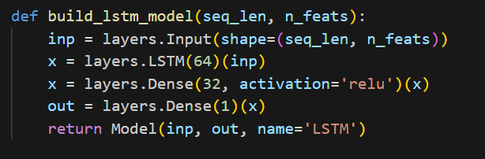 |
| --- | --- |
| RNN modelinin parametreleri | 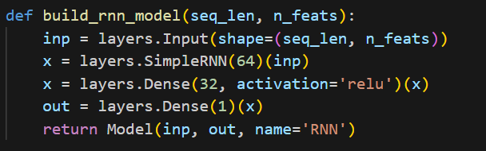 |
| --- | --- |
| CNN modelinin parametreleri | 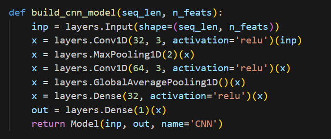 |
| --- | --- |
| Transformer modelinin parametreleri | 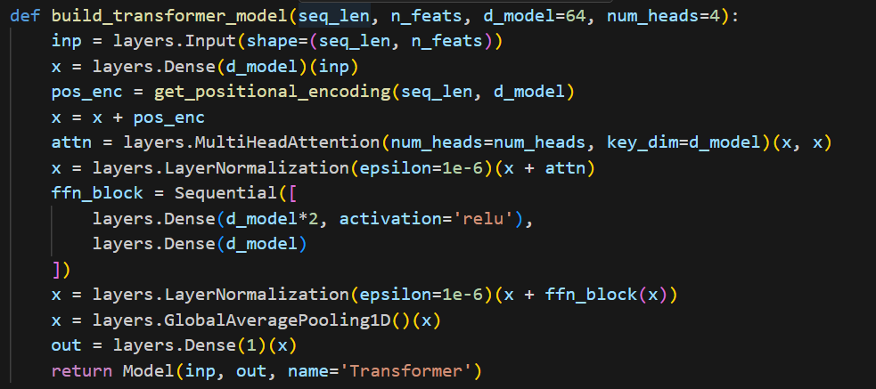 |
| --- | --- |
| Modellerinin MAE ve RMSE Performansı | 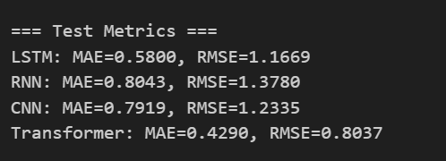 |
| --- | --- |

1.  Derin Öğrenme Modellerinin MAE ve RMSE Performansı

| 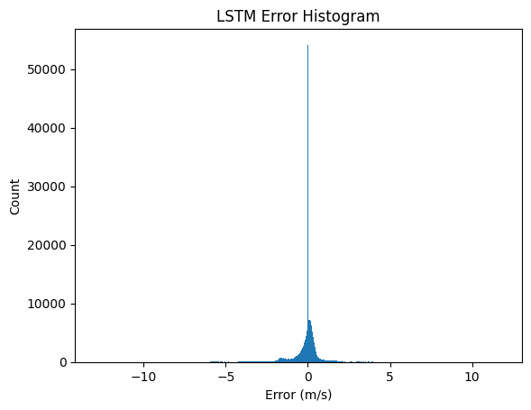 | 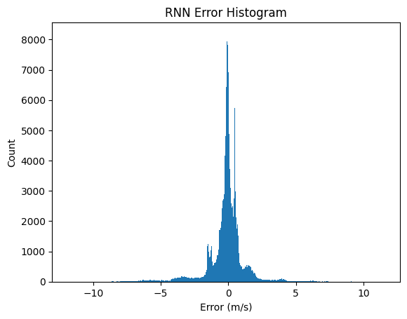 |
| --- | --- |
| 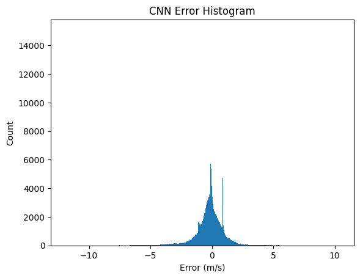 | 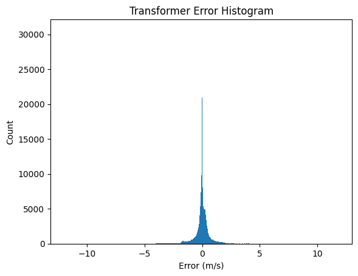 |
| --- | --- |
| 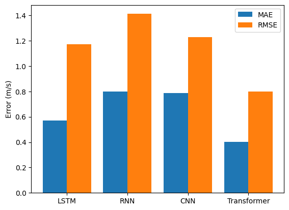 |
| --- |

1.  Derin Öğrenme Modellerinin Hata Performansı

Şekil 10 ve 11 incelendiğinde; Transformer modeli, hem ortalama hatada hem de karekök ortalama kare hatada diğer tüm modellere göre belirgin biçimde daha düşük değerler üreterek birinci oldu. LSTM, dönemsel bağımlılıkları yakalamada kendine has belleği sayesinde CNN ve RNN’den bariz şekilde daha iyi performans gösterirken; CNN, yerel desenleri filtre bankalarıyla tanıma kapasitesiyle RNN’i hafifçe geride bıraktı. RNN ise basit döngüsel yapısına rağmen hem MAE hem de RMSE’de en yüksek (yani en kötü) sonuçları verdi. Bu nedenle çalışmaya Transformer modeli ile devam edilmesine karar verildi.

## Transformer Derin Öğrenme Modelinin Eğitimi

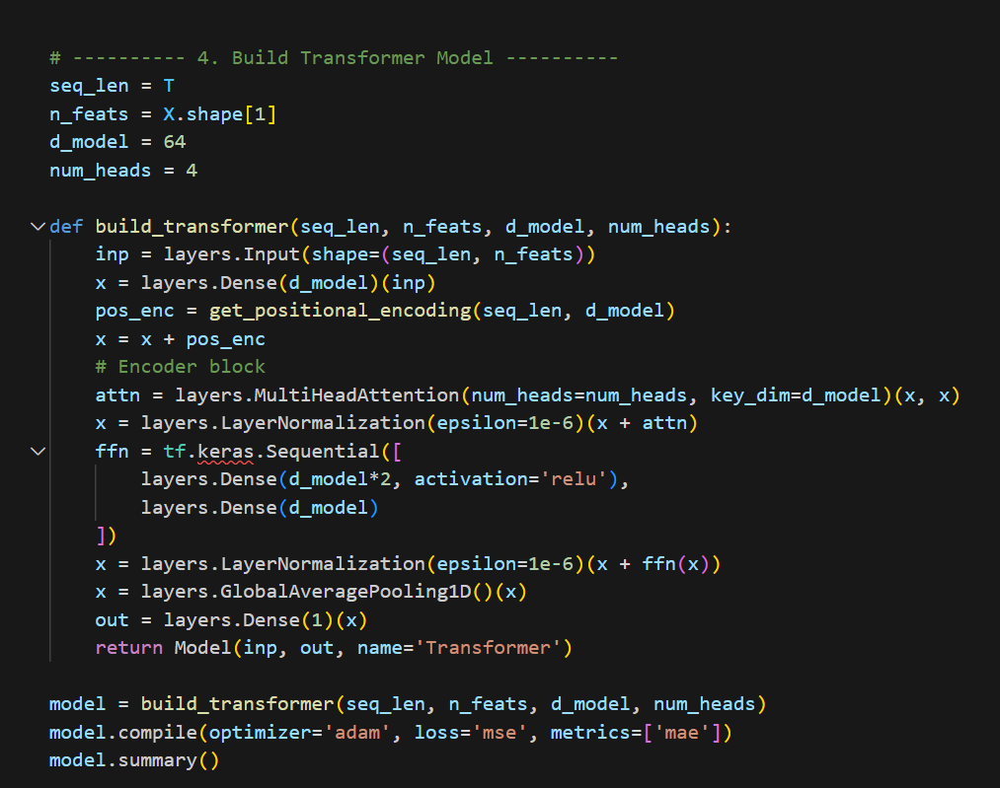

1.  Transformer Derin Öğrenme Modelinin Parametreleri

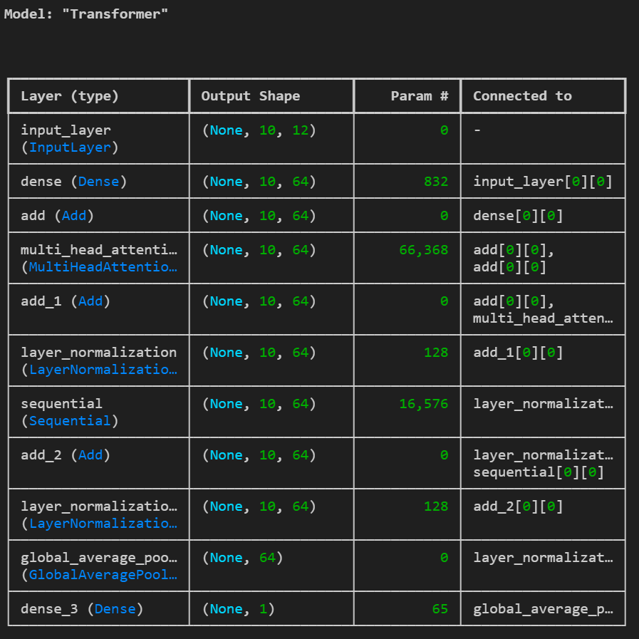

1.  Transformer Derin Öğrenme Modelinin Katman Bilgileri

Transformer modelinin parametreleri Şekil 12’de, katman bilgileri ise Şekil 13’te görülmektedir.

***InputLayer***

Model, (None, 10, 12) boyutunda bir InputLayer ile başlar. Burada 10, her bir örnekteki ardışık zaman adımı sayısını; 12 ise her bir zaman adımında gözlemlenen özellik (feature) sayısını temsil eder. Bu katman doğrudan parametre içermez ve yalnızca sonraki katmanlar için girdi biçimini tanımlar.

***Dense (Projeksiyon) Katmanı***

Giriş tensörü önce, her bir 12 boyutluk vektörü 64 boyuta genişleten bir Dense katmanına gönderilir. Bu katman 12×64 ağırlık matrisi ve 64 adet bias olmak üzere toplam 832 parametre öğrenir. Amacı, orijinal özellik uzayından daha yüksek boyutlu bir temsil alanına projeksiyon yaparak modelin daha karmaşık ilişkileri öğrenmesini sağlamaktır.

***Add (İlk Residual Bağlantı Hazırlığı)***

Projeksiyon çıktılarını bir sonraki adıma taşımadan önce, bir Add katmanı aracılığıyla başlangıçtaki embedding çıktısını doğrudan sonraki katmandaki girdiye eklemek üzere hazırlanır. Bu katman parametresizdir: sadece gelen iki girişi element-wise toplar ve residual öğrenmeyi kolaylaştırır.

***MultiHeadAttention Katmanı***

Toplama işleminden sonra gelen MultiHeadAttention (Çok Başlıklı Dikkat) katmanı, 8 dikkat başlığı kullanır; her başlık sorgu, anahtar ve değer için 64/8=8 boyutluk alt uzaylar üretir. Toplamda 66.368 parametre (ağırlık ve bias) içerir. Bu katman, zaman adımları arasındaki ilişkileri modelleyerek her bir token’ın diğer tüm token’lara ne kadar “dikkat” edeceğini öğrenir.

***Add\_1 (İlk Residual Bağlantı)***

Öz-dikkat (self‐attention) çıktısı, öncesindeki embedding çıktısıyla Add\_1 katmanında toplanır. Bu residual bağlantı, derin katmanlar arasında gradyan akışını iyileştirir ve öğrenmeyi stabilize eder. Parametresiz olan bu katman, element-wise toplama işlemi yapar.

***LayerNormalization (İlk Normlama)***

Toplamadan elde edilen tensör, 128 parametreli bir LayerNormalization katmanına girer. Burada her özellik boyutu için ayrı bir ölçek ve öteleme (gamma ve beta) öğrenilir. Katman, her örneğin zaman adımı boyutundaki vektörlerini normalize ederek aktivasyonların ortalamasını sıfır ve varyansını bire yakın tutar; böylece eğitim kararlılığı artar.

***Sequential (Beslemeli Ağ / Feed-Forward Bloğu)***

Normlanmış çıkış, içinde iki ardışık Dense katmanı barındıran 16.576 parametreli bir Sequential bloğuna alınır. Genellikle burada ilk katman 64→256, sonra 256→64 dönüşümü yapar; arada bir ReLU aktivasyonu bulunur. Amaç, token başına ayrı ayrı uygulanan küçük bir MLP ile lineer-dışı özellik etkileşimlerini modellemektir.

***Add\_2 (İkinci Residual Bağlantı)***

Feed-forward bloğunun çıktısı, önceki normlanmış tensör ile Add\_2 katmanında birleştirilir. Bu ikinci residual bağlantı, yine parametresiz element-wise toplama yaparak derin ağda gradyan akışını kolaylaştırır ve öğrenmeyi hızlandırır.

***LayerNormalization (İkinci Normlama)***

İkinci toplama işlemi sonrasında elde edilen tensör, bir kez daha 128 parametreli LayerNormalization katmanına alınır. Böylece hem öz-dikkat hem de feed-forward katmanlarından sonra aktivasyon dağılımları normalize edilmiş olur ve katmanlar arası istikrar sağlanır.

***GlobalAveragePooling1D***

Token düzeyindeki (None, 10, 64) tensör, GlobalAveragePooling1D ile zaman adımı boyutu boyunca ortalanarak (None, 64) boyutuna indirgenir. Bu katman herhangi bir parametre içermez ve sıralı bilgileri tek bir sabit boyutlu vektöre dönüştürür; böylece tüm token’ların temsil gücü tek vektörde toplanmış olur.

***Dense\_3 (Çıkış Katmanı)***

Son olarak, 64 boyutlu vektör, bir adet Dense çıkış katmanına (64→1) geçirilir. Bu katman 64 ağırlık ve 1 bias içererek toplam 65 parametre öğrenir. Modelin amacı örneğin regresyon göreviyse tek bir sürekli değer; sınıflandırma ise tek bir skor üretmektir.

Özetle, model önce özellikleri zenginleştiriyor sonra zaman içinde neye dikkat edeceğini öğreniyor. Bu bilgiyi bir ağ ile işleyip en sonunda tüm diziyi özetleyerek tek bir sonuç üretiyor. Bu akış, özellikle ardışık (sequence) verilerdeki önemli anları ve ilişkileri yakalamak için çok etkili bir yöntemdir.

| 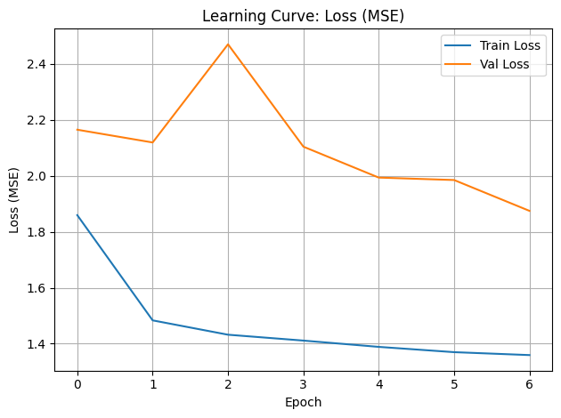 | 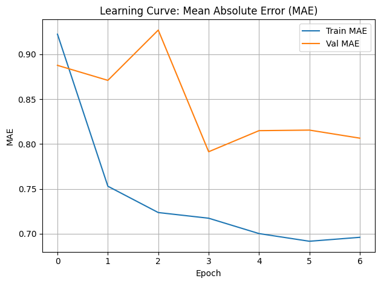 |
| --- | --- |
| 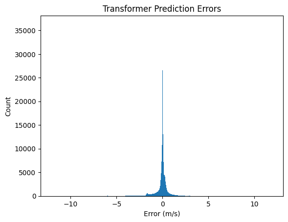 | 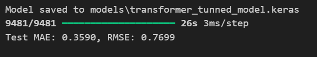 |
| --- | --- |

1.  Transformer Derin Öğrenme Modelinin Eğitim Eğrileri ve Hata Performansı

Test setindeki sonuçlara (bkz. Şekil 14) bakıldığında; MAE (Ortalama Mutlak Hata) = 0.359 m/s. Yani modelin tahmin ettiği dikey hız (climb rate) değerleri ile gerçek değerler arasındaki ortalama sapma yaklaşık 0.36 m/s. Tipik termik tırmanış hızları 1–3 m/s civarında olduğu için, verinin en canlı olduğu -2 ile +2 m/s aralığında ortalama 0.36 m/s’lik bir hata makul ve kullanılabilir bir doğruluk seviyesi sunuyor. RMSE (Karekök Ortalama Kare Hata) = 0.7699 m/s. RMSE, büyük hatalara (outlier’lara) MAE’den daha fazla ağırlık verir. Burada RMSE’nin MAE’den yaklaşık iki kat büyük olması, veri setinde nadiren de olsa birkaç büyük sapmanın (±5 m/s ve ötesi) olduğunu gösteriyor. Grafikteki tahmin hataları dağılımı da bu yorumları teyit ediyor. Dağılım simetrik bir şekilde 0 etrafında yoğunlaşmış çoğu tahmin ±1 m/s aralığında. Grafiğin ortasındaki sivri tepe, binlerce tekil örneğin neredeyse tam isabetle (hata ≃ 0) tahmin edildiğini gösteriyor. Uzun kuyruklar nadiren de olsa ±5–10 m/s aralığına kadar uzanıyor; bu hatalar RMSE’yi besleyen “uç değerler.”

Model çoğu zaman yüksek doğrulukla çalışıyor, ortalama sapma 0.36 m/s civarında ve ±1 m/s içinde yoğunlaşmış. Nadir görülen büyük hatalar olması RMSE’yi yükseltiyor; bu örnekler muhtemelen uçuş verisindeki gürültü, eksik termik işaretleri ya da veri ön işleme aşamasındaki atlanmış anomalilerden kaynaklanıyor.

Daha sonra oluşturulacak veri setinde, ±3 m/s’in ötesindeki hataları inceleyip filtrelemek veya veri ön işleme uygularken zskore yerine RMSE’yi biraz daha ölçülü kılmak için Huber loss gibi uç değerlere daha toleranslı alternatifler denenebilir. Termik tespiti için hava hızı, rüzgar yönü gibi ek sensör verileri veya gecikmeli (lag) özellikler ekleyerek kötü tahmin edilen örneklerin azaltılması hedeflenebilir. Transformer’ın boyutu (katman sayısı, gizli boyut) veya öğrenme hızı, dropout oranı gibi hiperparametrelerin yeniden taranması; gerekirse ensemblling (farklı mimarilerden ortak tahmin) yapılması. Sonuç olarak, MAE≈0.36 m/s ve çoğu hatanın ±1 m/s içinde toplanması, parça parça gelişebilen bir rehberlik sistemi veya pilot eğitim asistanı için oldukça rekabetçi bir performans sağlar. Daha uzak uçlardaki hataları sönümlendirmek ise bir sonraki optimizasyon adımı olabilir.

## Yamaç Paraşütü Uçuşunun Analiz Edilmesi ve Skorlanması

Bu bölümdeki amaç; bir uçuş verisindeki tırmanma değerlerinin Transformer Derin Öğrenme Modeli ile tahmin edilerek, gerçek tırmanış verisi ve tahmin edilen tırmanış verileri üzerinden uçuşun skorlanması işlemidir. Önce uçuş verisi, Transformer Derin Öğrenme Modelinin eğitim aşamasında olduğu gibi işlenip hazırlandı. Sonra eğitilmiş olan model ile tırmanış verileri tahmin edilerek aynı tabloda gerçek uçuş verisinin yanına yazıldı.

Çalışmaya, Leonardo alt yapısından seçilen aynı gün yapılmış uçuş kayıtları ile başlandı. Alınan uçuş kayıtları ile önce skorlama için Pearson Benzerliği kullanıldı. Pearson Benzerliği \[20\] (Pearson Similarity ya da Pearson korelasyon katsayısı), iki değişken (veya iki kullanıcı/öge vektörü) arasındaki doğrusal ilişkiyi – yani birlikte nasıl arttıklarını veya azaldıklarını – ölçen standartlaştırılmış bir benzerlik ölçüsüdür (Metin içi gönderme eklenmeli). Değer −1 ile +1 arasında değişir. +1 tam pozitif korelasyon (biri artarken diğeri de artar), 0 korelasyon yok (aritmetik bağımsızlık) ve −1: Tam negatif korelasyon (biri artarken diğeri azalır) anlamına gelmektedir.

Pearson Benzerliği ile ilgili ortaya çıkan en önemli problem, uçuş süresi uzadıkça tahmin edilen ve gerçek veri arasındaki benzerliğin azalması ve değerin -1’e doğru kaymasıdır. Sonuçlar, 0 ile 100 aralığında normalize edilerek Tablo 7’de gösterilmiştir.

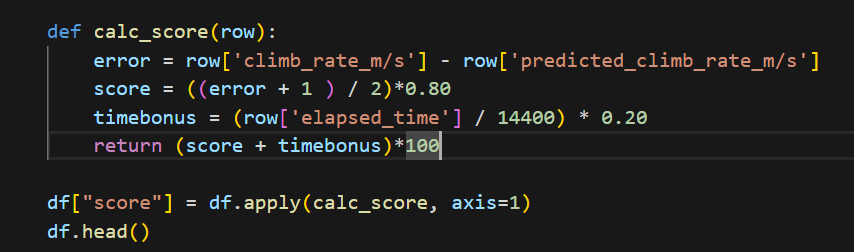

1.  Performans Skorlaması

Pearson Benzerliğindeki bu problem nedeniyle, Şekil 15’te görülen kod ile farklı bir performans hesaplaması yapılmıştır. Bu kod, her bir satır için gerçek (climb\_rate\_m/s) ve tahmin edilen (predicted\_climb\_rate\_m/s) tırmanma hızı farkını 0…1 aralığına getirip %80 ağırlıkla puana dönüştürür, geçen süreyi (maks. 4 saat) 0…1 aralığında normalize ederek %20 ağırlıklı zaman bonusu ekler ve bunların toplamını 0…100 ölçeğine çevirerek skor elde edilir. Böylece daha uzun uçulan uçuşlarda zaman ilerledikçe bir zaman bonusu eklenmiş olur.

Elde edilen performans skoru eklenmiş olsa da, Tablo 7’de görüldüğü üzere Pearson Benzerliği verileri korunmuştur. Amaç, ileride çok daha geniş kümeler ile test ederek sonucun bu geniş kümede nasıl dağıldığını bulabilmektir.

1.  Performans Skorlaması

| **Uçuş adı** | 12025-05-10-XCT-MKA-01 | 2025-05-10-XCT-FBA-02 | 2025-05-10-XCT-SKA-02 | 2025-05-10-XCT-TRE-01 | 2025-05-10-XCT-YCA-01 |
| --- | --- | --- | --- | --- | --- |
| **Uçuş tarihi** | 10.05.2025 | 10.05.2025 | 10.05.2025 | 10.05.2025 | 10.05.2025 |
| --- | --- | --- | --- | --- | --- |
| **Pilot adı** | Mehmet Ali KAYA | Ferkan Bayram | Soner Kaya | Turgut Reis | yilmaz cansari |
| --- | --- | --- | --- | --- | --- |
| **En yüksek irtifa** | 3938 m | 3121 m | 1971 m | 2244 m | 3776 m |
| --- | --- | --- | --- | --- | --- |
| **En yüksek hız** | 74.78 km/s | 74.15 km/s | 70.40 km/s | 62.10 km/s | 83.78 km/s |
| --- | --- | --- | --- | --- | --- |
| **Toplam mesafe** | 227.50 km | 82.78 km | 17.89 km | 28.73 km | 209.14 km |
| --- | --- | --- | --- | --- | --- |
| **En uzun mesafe** | 151.11 km | 49.37 km | 7.52 km | 9.05 km | 142.16 km |
| --- | --- | --- | --- | --- | --- |
| **Pearson similarity** | %68,60 | %67,48 | %69,28 | %72,19 | %70,85 |
| --- | --- | --- | --- | --- | --- |
| **Performans Skoru** | %66,86 | %84,20 | %60,25 | %5971 | %71,45 |
| --- | --- | --- | --- | --- | --- |
| **Toplam süre** | 05:42:17 | 02:11:25 | 00:30:09 | 00:50:42 | 04:33:40 |
| --- | --- | --- | --- | --- | --- |

# Sonuç ve Değerlendirme

Yamaç paraşütü yapısı itibariyle tüm hava araçlarından önemli bir ölçüde ayrılmaktadır. Kanat pilotun 6-7 metre üzerinde bulunur. Bu nedenle ağırlık merkezi çok aşağıdır. Bu durum yamaç paraşütünün bir sarkaç gibi davranarak otomatik stabilizasyon gibi bir yeteneğe sahip olmasını sağlar. Kanadın içi hava ile doludur ve hiçbir hava aracında olmayan bir şekilde formu sürekli olarak değişir. Yamaç paraşütünün bu benzersiz yapısı, hem pasif hem de aktif stabilizasyonu bir arada sunar. İçinin hava ile dolması sayesinde kanat, dinamik yük değişimlerine karşı “kendini düzeltme” eğilimindedir; kanat hücrelerindeki basınç bir tarafa fazla binince diğer hücrelerden temiz hava akışı sağlanır ve orijinal şekil hızlıca geri kazanılır. Bu sayede pilot, küçük türbülansları hissetmeden daha konforlu ve güvenli bir uçuş deneyimi yaşar.

Kanadın sürekli değişen formu; rüzgâr yönü, hız değişimleri, termik oluşumları ve türbülansla etkileşime girdiğinde her seferinde farklı tepkiler verebilir. Bu nedenle pilotun kanadı “okuma” ve ani değişikliklere hızlı tepki verme yeteneği kritik öneme sahiptir. Pasif stabilizasyon sayesinde küçük sarsıntılar otomatik olarak düzeltilirken, güçlü türbülans ya da ani termik sınır geçişlerinde kanat şeklinin beklendiği gibi korunamaması kısa süreli dalgalanmalara yol açabilir. Yamaç Paraşütünün bu yapısı, performans açısından yamaç paraşütünü diğer hava araçlarına kıyasla daha az öngörülebilir kılar.

Makine öğrenmesi ile tırmanış verilerini tahmin etmek yukarıda belirtilen nedenlerden dolayı son derece zordur. Klasik makine öğrenmesi modelleri tırmanış verilerini tahmin etmekte çok başarısız olmuştur. Derin öğrenme modellerinden ise ancak zaman serisi modelleri yüksek başarı seviyesine ulaşmıştır.

Bu çalışmada, yamaç paraşütü pilotlarının uçuş performansını daha doğru ve bilimsel yöntemlerle değerlendirebilmek amacıyla uçuş kayıtlarının analizi yapılmıştır. Çalışmanın amacı, GPS ve meteorolojik veriler kullanılarak pilotların tırmanış hızlarını tahmin etmek ve bu sayede performans değerlendirmelerini daha objektif bir hale getirmektir. Çalışmanın kapsamını IGC formatında toplanmış gerçek uçuş kayıtları ve bu uçuşlarla eşleştirilen hava durumu verileri oluşturmaktadır. Araştırma soruları doğrultusunda elde edilen sonuçlar, uçuş metriklerinin güvenilir bir şekilde çıkarılabileceğini ve özellikle Transformer modelinin pilot tırmanış hızlarını yüksek doğrulukla tahmin edebildiğini göstermiştir. Bu sonuçlar doğrultusunda oluşturulan hipotezlerin tamamının kabul edildiği görülmüştür.

Transformer modeli, sahip olduğu çok başlıklı kendine-dikkat (multi-head self-attention) mekanizması sayesinde, hem giriş dizisi hem de çıktıda paralel hesaplamaya izin verir. Böylece uzun-bağlam bağımlılıklarını RNN tabanlı modellerde olduğu gibi ardışık adımlarla değil, doğrudan yakalayabilir. Performans karşılaştırmasına baktığımızda, Transformer’ın test setindeki hata metrikleri diğer modellere kıyasla açık ara öndedir (MAE = 0,36 m/s, RMSE = 0,77 m/s). Dikkat mekanizması ile kritik zaman adımlarını vurgulayıp, Paralel hesaplama ile eğitim ve tahmin süreçlerini hızlandırıp, Uzun bağlam ilişkilerini doğrudan modelleyerek diğer derin öğrenme mimarilerinin tümünde yakalanamayan performans seviyesine ulaşmıştır. Bu nedenle, sonraki analiz ve uygulamalarda Transformer mimarisi tercih edilmiştir.

Uçuş verilerine dayalı geliştirilen derin öğrenme modellerinin tahmin doğruluğunu artıran temel faktörlerin başında, yeterli sayıda ve çeşitli veri kullanılması gelir. Ne kadar fazla ve farklı uçuş verisiyle model eğitilirse, model gerçek uçuş koşullarını o kadar iyi öğrenir ve genelleyebilir. Bunun yanında, verinin eksiksiz ve hatasız olması, uçuş sırasında sensörlerden alınan bilgilerin doğru şekilde temizlenmesi ve ön işlenmesi de büyük önem taşır. Özellikle uçuş performansını yansıtan metriklerin doğru seçilmesi, yani modelin en anlamlı özelliklerle beslenmesi, tahmin sonuçlarını doğrudan etkiler. Model mimarisinin uçuş verisinin yapısına uygun olması, örneğin uzun zaman aralıklarındaki bağımlılıkları yakalayabilen LSTM ya da Transformer gibi modellerin tercih edilmesi, modelin başarısını artırır. Ayrıca, modelin aşırı öğrenmesini önlemek için uygun yöntemlerin kullanılması da doğruluk üzerinde önemli bir rol oynar. Sonuç olarak, verinin kalitesinden başlayarak modelin eğitimi ve seçimine kadar her adımın dikkatli bir şekilde yapılması, uçuş performansı tahminlerinde yüksek doğruluk elde edilmesini sağlar.

Elde edilen bulgular, pilot performans değerlendirmelerinde geleneksel yöntemlere kıyasla daha hassas ve objektif ölçümler sunmaktadır. Pilot eğitimlerinin ve uçuş güvenliğinin artırılması açısından elde edilen sonuçların önemli bir potansiyele sahip olduğu değerlendirilmiştir.

Bu çalışma kapsamında elde edilen bulgulardan hareketle; daha fazla veri kullanılarak model doğruluğunun artırılması, saha uygulamalarının yaygınlaştırılması ve gerçek zamanlı analiz sistemlerinin geliştirilmesi önerilmektedir. Gelecek araştırmaların özellikle farklı çevresel koşullarda ve geniş pilot profilleri üzerinde yapılması, modelin genelleştirilebilirliğinin artırılması açısından kritik öneme sahiptir.

Sonuç olarak; oluşturulan Transformer Derin Öğrenme modelinin performansı tatmin edici olarak değerlendirilmiştir. Verinin toplanması, hazırlanması, zenginleştirilmesi ve temizlenmesi süreçlerinin elde edilen sonuç üzerindeki etkisinin epey önemli olduğu deneyimlenmiştir. Birçok kez projenin en başına dönülerek tekrar hazırlamak zorunda kalınmıştır. Bu araştırma esnasındaki deneyimlerden, elde edilen sonuçlardan ve tespit edilen bazı problemlerden yola çıkarak sunulabilecek öneriler şunlardır;

-   Bazı uçuş kayıtlarının içerisinde basınç altimetresi verileri olmaması nedeniyle makine öğrenmesi esnasında sadece GPS verileri kullanılmak zorunda kalınmıştır. Daha ileri dönemde veri setinde barometrik altimetre verilerinin de eklenmesi düşünülebilir.
-   100 uçuş kaydı ile oluşturulan veri setinde bir sonraki versiyonda 500 veya 1000 uçuş kaydı ile çalışılabilir ve bu veri setine dünya genelindeki pilotlar dahil edilebilir.
-   Süzülüş (glide\_ratio) verisi veri setinden çıkartılarak yeni performans değerlendirilebilir.
-   Birden fazla Transformer Modeli hazırlanarak aralarındaki performans farkları incelenebilir.
-   LSTM modeli üzerinde daha geniş bir veri seti ile çalışılabilir.
-   Sadece tırmanış değil, yön (bearing) verisinin de tahmini üzerine model oluşturulabilir.
-   Tırmanış ve yön verisi üzerine performans puanlaması yapılabilir.

Bu projeye ait tüm kodlar Github’da paylaşılmıştır \[21\].

# Kaynakça

1.  FAI, Technical Specification For IGC-Approved GNSS Flight Recorders, [https://www.fai.org/sites/default/files/igc\_fr\_specification\_2020-11-25\_with\_al6.pdf](https://www.fai.org/sites/default/files/igc_fr_specification_2020-11-25_with_al6.pdf), **2020**
2.  FAI, IGC-Approvals for GNSS Flight Recorders, [https://www.fai.org/sites/default/files/igc-approval\_table\_history\_-\_2021-8-22.pdf](https://www.fai.org/sites/default/files/igc-approval_table_history_-_2021-8-22.pdf), **2021**
3.  FAI, XC Scoring, [https://www.fai.org/sites/default/files/civl/documents/sporting\_code\_s7\_f\_-\_xc\_scoring\_2024.pdf](https://www.fai.org/sites/default/files/civl/documents/sporting_code_s7_f_-_xc_scoring_2024.pdf), **2024**
4.  Forster-Lewis, I., IGC File Format Reference and Developers' Guide, [https://xp-soaring.github.io/igc\_file\_format/igc\_format\_2008.html](https://xp-soaring.github.io/igc_file_format/igc_format_2008.html), **2008**
5.  Goodfellow, I., Bengio, Y. ve Courville, A., Deep Learning (MIT Press), [https://mitpress.mit.edu/9780262035613/deep-learning/](https://mitpress.mit.edu/9780262035613/deep-learning/%20), **2016**.
6.  Teskey, P. B. ve Fox, R., Use of GPS for Determining Free Flight Performance, **2002**
7.  Newton, L. J., Learning Neural Network Representations of Aircraft Flight Dynamics, **2020**
8.  Zheng, Y., Tao, J., Sun, Q., Sun, H., Chen, Z., Sun, M., ve Duan, F., Deep-Reinforcement-Learning-Based Active Disturbance Rejection Control for Lateral Path Following of Parafoil System. Sustainability, 15, 435. [https://www.mdpi.com/2071-1050/15/1/435](https://www.mdpi.com/2071-1050/15/1/435), **2023**
9.  Clark, P., XC Secrets: Learning From Tracklogs, [https://flybubble.com/blog/xc-secrets-learning-from-tracklogs](https://flybubble.com/blog/xc-secrets-learning-from-tracklogs), **2020**
10.  Heatwole, P., Parametric Paraglider Modeling, [https://github.com/pfheatwole/thesis](https://github.com/pfheatwole/thesis), **2022**
11.  Heatwole, P., glidersim, [https://github.com/pfheatwole/glidersim](https://github.com/pfheatwole/glidersim), **2021**
12.  Momtchev, M., igc-xc-score, [https://github.com/mmomtchev/igc-xc-score](https://github.com/mmomtchev/igc-xc-score), **2007**
13.  OpenWeather, OpenWeather One Call API 3.0, [https://openweathermap.org/api/one-call-3](https://openweathermap.org/api/one-call-3), **2025**
14.  Manolis, A., Leonardo XC Server. [https://www.ypforum.com/leonardo/](https://www.ypforum.com/leonardo/), **2011**
15.  Demsar, J., Curk, T., Erjavec, A., Gorup, C., Hocevar, T., Milutinovic, M., Mozina, M., Polajnar, M., Toplak, M., Staric, A., Stajdohar, M., Umek, L., Zagar, L., Zbontar, J., Zitnik, M., Zupan, B., Orange: Data Mining Toolbox in Python, Journal of Machine Learning Research 14(Aug): 2349−2353. [http://jmlr.org/papers/v14/demsar13a.html](http://jmlr.org/papers/v14/demsar13a.html), **2013**
16.  Pedregosa, F., Varoquaux, G., Gramfort, A., Michel, V., Thirion, B., Grisel, O., Blondel, M., Prettenhofer, P., Weiss, R., Dubourg, V., Vanderplas, J., Passos, A., Cournapeau, D., Brucher, M., Perrot, M., Duchesnay, E., Scikit-learn: Machine Learning in Python, Journal of Machine Learning Research (sayı 12, sayfa 2825-2830), [https://jmlr.csail.mit.edu/papers/v12/pedregosa11a.html](https://jmlr.csail.mit.edu/papers/v12/pedregosa11a.html),  
     [https://scikit-learn.org/](https://scikit-learn.org/), **2011**
17.  Abadi, M., Agarwal, A., Barham, P., Brevdo, E., Chen, Z., Citro, C., Corrado, G.S., Davis, A., Dean, J., Devin, M., Ghemawat, S., Goodfellow, I., Harp, A., Irving, G., Isard, M., Jozefowicz, R., Jia, Y., Kaiser, L., Kudlur, M., Levenberg, J., Mané, D., Schuster, M., Monga, R., Moore, S., Murray, D., Olah, C., Shlens, J, Steiner, Benoit, Sutskever, I., Talwar, K., Tucker, P., Vanhoucke, V., Vasudevan, V., Viégas, F., Vinyals, O., Warden, P., Wattenberg, M., Wicke, M., Yu, Y. ve Zheng, X., TensorFlow: Large-scale machine learning on heterogeneous systems, [https://www.usenix.org/system/files/conference/osdi16/osdi16-abadi.pdf](https://www.usenix.org/system/files/conference/osdi16/osdi16-abadi.pdf), [https://www.tensorflow.org/](https://www.tensorflow.org/), **2015**
18.  LeCun, Y., Bengio, Y. Ve Hinton, G., Deep learning, Nature (vol521, 28 May 2015, syf.436-444), **2015**
19.  Schultz, A., Thipphavong, D., & Erzberger, H. (2012, Eylül). Adaptive trajectory prediction algorithm for climbing flights (AIAA Paper No. 2012-4931). AIAA/ISSMO Multidisciplinary Analysis and Optimization Conference. [https://doi.org/10.2514/6.2012-4931](https://doi.org/10.2514/6.2012-4931), **2012**
20.  Pearson, K. Note on regression and inheritance in the case of two parents. Proceedings of the Royal Society of London, 58, 240–242. [https://doi.org/10.1098/rspl.1895.0041](https://doi.org/10.1098/rspl.1895.0041), **1985**
21.  S. Kurd, Paragliding Flight Analyses, GitHub repository, [https://github.com/SerkanKurd/Paragliding\_Flight\_Analyses](https://github.com/SerkanKurd/Paragliding_Flight_Analyses), **2025**